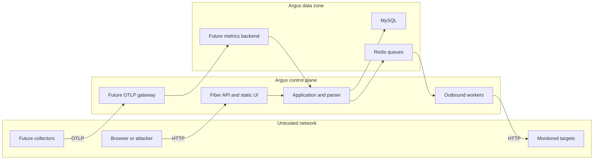

# Argus Threat Model

Date: 2026-07-28
Repository baseline: `b576998`
Assumption check-in status: the requested deployment-context questions were raised during the review. No clarifying answer was supplied, so this report uses the conservative assumptions below and marks conclusions that would change if they are incorrect.

## Executive summary

Argus combines an internet-facing management API, stored credentials and a server-side HTTP requester. Its dominant risks are therefore control-plane authentication failure, SSRF/egress abuse, unsafe state-changing probes, credential theft through browser injection, and tenant-authorization mistakes. The legacy API's fail-open API-key behavior and less-hardened HTTP client make the strongest current attack chain. Monitoring v2 should reduce outbound-request exposure, but an OTLP gateway introduces a new tenant-attribution and cardinality boundary that must be designed as hostile input from day one.

## Scope and assumptions

In scope:

- `frontend/`
- `cmd/api/`, `internal/app/`, `internal/platform/httpserver/`
- `internal/api/`, `internal/adapters/inbound/http/`
- `internal/application/`, `internal/domain/`
- `internal/worker/`, `internal/platform/worker/`
- `internal/adapters/outbound/mysql/`, `db/migrations/`
- `internal/openapi/`
- `docker-compose.yml`, `.env.example`, `go.mod`, `go.sum`
- the proposed design in `docs/audit-2026-07-28-en/ARGUS_TRANSFORMATION_BLUEPRINT.md`, clearly separated from current runtime behavior

Out of scope:

- the security configuration of an external reverse proxy, CDN, host firewall or cloud account not present in the repository;
- end-user monitored services and their business authorization rules;
- an external email provider, vault or OTel backend not yet selected/implemented;
- local developer machines and editor extensions, except dependency/install risk noted at a high level;
- penetration testing against a deployed system.

Material assumptions:

- Argus must support both private self-hosting and a possible future internet-facing, multi-tenant service. Controls are therefore ranked for the stronger boundary; a permanently private single-tenant deployment reduces likelihood but not design impact;
- private-network targets are monitored through a customer-side agent. The central control plane does not receive a general ability to dial arbitrary customer-private addresses;
- metrics retention defaults to 30 days and is configurable. No specific residency, regulated-data, or compliance regime is assumed; such a requirement would change storage, encryption, deletion, audit, and regional architecture;
- the service can be internet-reachable because it binds to `:8080` by default (`internal/config/config.go:49-53`);
- the target architecture supports multiple users/projects and may support multiple tenants, so tenant attribution and authorization are security boundaries;
- route headers, API keys, auth tokens and telemetry may be sensitive;
- users can add URLs and upload/import OpenAPI documents;
- Docker Compose self-hosting is the current operational baseline;
- project scale can reach thousands of routes because imports allow up to the repository's configured parser limits.

Assumptions to reconfirm before implementation:

1. If Argus will be permanently private and single-tenant, cross-tenant threats can be downgraded, but fail-open management access and outbound-request abuse remain release risks.
2. If the central worker must reach private targets, the design needs a separate egress trust zone, destination registration/approval, and stronger network enforcement; simply enabling the existing private-target flag is insufficient.
3. If residency or regulated-data requirements apply, telemetry collection must be minimized and region/deletion/key-management controls must be designed before ingestion is enabled.

## System model

### Primary components

- **Browser UI**: static HTML/CSS/JavaScript, legacy API-key client and project bearer-token client (`frontend/index.html`, `frontend/app.js`, `frontend/projects.js`).
- **Fiber HTTP server**: static delivery, public auth/status entry points and private management APIs (`internal/platform/httpserver/fiber.go`, `internal/api/`).
- **Application/domain layer**: auth, projects, routes, imports, incidents and policy logic (`internal/application/`, `internal/domain/`).
- **MySQL**: users, token hashes, project/route definitions, check history, incidents and secret-bearing headers (`internal/adapters/outbound/mysql/`, `db/migrations/`).
- **Redis/Asynq**: scheduled check and worker queues (`internal/platform/worker/`, `internal/config/config.go`).
- **Outbound workers**: active HTTP/TLS/keyword/route checks against user-selected targets (`internal/worker/processor.go`, `internal/worker/route_evaluator.go`).
- **OpenAPI parser**: multipart/JSON/YAML parsing, reference resolution and bounded operation import (`internal/openapi/`, `internal/api/import_handler.go`).
- **Proposed Monitoring v2 gateway**: future authenticated OTLP ingestion and metrics backend; design only, not current runtime (`docs/audit-2026-07-28-en/ARGUS_TRANSFORMATION_BLUEPRINT.md`).

### Data flows and trust boundaries

- **Internet browser → Fiber API**
  - Data: credentials, bearer/API-key headers, project/route configuration, filters and mutations.
  - Channel: HTTP; TLS is assumed at an external edge and is not configured in-repo.
  - Guarantees: bearer auth on Projects; optional/fail-open API key on legacy routes; Helmet defaults and body limit.
  - Validation: Fiber JSON parsing plus per-handler/domain checks; no visible auth rate limiter.

- **Browser → static frontend execution**
  - Data: API responses, stored tokens/preferences and URL hash state.
  - Channel: same-origin DOM/JavaScript.
  - Guarantees: manual `escapeHtml` in many render paths; no explicit strict CSP.
  - Validation: inconsistent by output context; inline event handlers remain.

- **Fiber application → MySQL**
  - Data: password hashes, token hashes, roles, target URLs, route headers, incidents/checks.
  - Channel: MySQL driver using configured DSN.
  - Guarantees: parameterized queries are visible in repositories; database encryption/transport guarantees are not established in repo.
  - Validation: application/domain checks before persistence; secret headers are redacted on read but stored for worker use.

- **Scheduler/application → Redis/Asynq → worker**
  - Data: resource IDs and due-check jobs.
  - Channel: Redis protocol inside deployment network.
  - Guarantees: Redis password is optional; queue payloads should be treated as integrity-critical.
  - Validation: worker reloads records by ID; queue fairness/global abuse caps are limited.

- **Outbound worker → monitored target**
  - Data: method, URL, headers/credentials and synthetic parameter values.
  - Channel: HTTP(S), DNS and TLS across an untrusted network.
  - Guarantees: newer route evaluator has dial-time IP and redirect controls; legacy evaluator uses `http.DefaultClient`.
  - Validation: URL allowlist/private-range policy varies between worker paths.

- **User → OpenAPI parser → route persistence**
  - Data: untrusted multipart file or JSON/YAML document, references, paths, schemas and examples.
  - Channel: HTTP upload, in-process parsing, MySQL persistence.
  - Guarantees: request/document/operation/reference budgets exist.
  - Validation: parser constraints and domain method/path normalization; import currently activates selected routes.

- **Future customer Collector → Monitoring v2 gateway**
  - Data: untrusted OTLP metrics/traces/logs and resource attributes.
  - Channel: proposed TLS/mTLS or scoped authenticated OTLP.
  - Guarantees: not implemented; design requires server-side tenant attribution and cardinality limits.
  - Validation: proposed allowlist/drop/budget pipeline; must not trust client-provided project IDs.

#### Diagram

## Assets and security objectives

| Asset | Why it matters | Security objective (C/I/A) |
|---|---|---|
| Password hashes and session/API tokens | account takeover and persistence if exposed | C, I |
| Monitored-service Authorization/Cookie/API-key headers | may grant access to customer production APIs | C, I |
| Project membership and roles | enforce tenant and privilege boundary | I, C |
| Target/environment definitions | control where privileged workers send requests | I |
| Incident/check/SLO history | drives operational decisions and pages | I, A |
| MySQL data and backups | aggregates identity, secrets and monitoring history | C, I, A |
| Redis queues | job integrity and scheduler availability | I, A |
| Outbound worker capacity and source IP reputation | can be abused for scanning/DoS; needed for monitoring | A, I |
| OpenAPI uploads and parser capacity | attacker-controlled complex documents consume resources | A, I |
| Static frontend origin | executes with access to browser-readable credentials | I, C |
| Future telemetry tenant metadata | wrong attribution leaks/corrupts cross-tenant health | C, I |
| Build dependencies and container artifacts | compromise becomes server/browser code execution | I |

## Attacker model

### Capabilities

- remote unauthenticated HTTP client reaching the exposed service;
- registered low-privilege user in a multi-user deployment;
- authorized project editor supplying URLs, headers, route templates and OpenAPI files;
- control of DNS and HTTP responses for a monitored target, including redirects;
- ability to induce high request volume and crafted parser payloads within connection/body limits;
- ability to inject hostile data into an API response if another storage/input flaw exists;
- future malicious/compromised OTel client sending arbitrary attributes and volume with its own credential.

### Non-capabilities

- no assumed shell/root access to the Argus host, MySQL or Redis;
- no assumed ability to break TLS, bcrypt, SHA-256 or `crypto/rand`;
- no assumed cross-project write permission where current authorization checks are correctly applied;
- no assumed compromise of GitHub, upstream Go modules or container registry;
- no assumed ability to access private targets when egress firewalls and the hardened dialer correctly block them;
- no assumed production OTel gateway today; threats to it are design-time conditions.

## Entry points and attack surfaces

| Surface | How reached | Trust boundary | Notes | Evidence (repo path / symbol) |
|---|---|---|---|---|
| Register/login | public POST | Internet → API | bcrypt work, no visible limiter | `internal/api/auth_handler.go:RegisterAuthRoutes` |
| Legacy management API | `/api/websites`, features, logs | Internet → API | API key bypasses when empty | `internal/adapters/inbound/http/middleware.go:APIKeyAuth` |
| Project/route API | bearer-authenticated `/api/projects` | User → tenant data | role matrix exists | `internal/platform/httpserver/fiber.go:NewFiberApp`; `internal/api/handlers_test.go:TestProjectAuthorizationMatrix` |
| OpenAPI import | multipart/body upload | User → parser | complex untrusted JSON/YAML/refs | `internal/api/import_handler.go`; `internal/openapi/` |
| Browser DOM render | API data to `innerHTML`/handlers | API/storage → browser execution | manual contextual escaping | `frontend/app.js:renderWebsites`; `frontend/projects.js` render helpers |
| URL hash router | location hash | Browser URL → application state | IDs parsed from hash | `frontend/projects.js:parseHash` |
| Route evaluator | queued route to HTTP client | Control plane → untrusted network | hardened path | `internal/worker/route_evaluator.go` |
| Legacy evaluator | queued website to default client | Control plane → untrusted network | redirect/rebinding parity gap | `internal/worker/processor.go` |
| MySQL DSN/config | environment and `.env` | Operator → process | defaults include known dev credentials | `internal/config/config.go:Load`; `.env.example` |
| Redis/Asynq | deployment network | Application → queue | optional password | `internal/config/config.go:Load` |
| Future OTLP | public/scoped ingest | Customer workload → data plane | design-time only | `docs/audit-2026-07-28-en/ARGUS_TRANSFORMATION_BLUEPRINT.md` |

## Top abuse paths

1. **Unauthenticated control-plane takeover**
   1. Operator deploys with the default empty `API_KEY`.
   2. Remote attacker calls legacy create/update/delete endpoints.
   3. Attacker alters monitors, consumes worker capacity and seeds browser-rendered data.
   4. Monitoring integrity and availability are lost.

2. **SSRF through the legacy worker**
   1. Attacker gains target-write access through the fail-open API or a legitimate account.
   2. Attacker supplies a host whose initial validation appears public.
   3. DNS rebinding or redirect leads `http.DefaultClient` toward a private/metadata address.
   4. Worker probes internal services; response/status/timing become an oracle.

3. **Production data mutation by imported route**
   1. Project editor imports a valid OpenAPI file.
   2. Selected POST/PUT/PATCH/DELETE routes are persisted enabled.
   3. Scheduler sends credentialed state-changing requests and retries failures.
   4. Production records are created, changed or deleted.

4. **Stored DOM injection to credential theft**
   1. Attacker stores a crafted monitor URL through a writable legacy path.
   2. Admin opens the dashboard; URL is interpolated into an inline JavaScript handler.
   3. Context-mismatched escaping permits script execution.
   4. Script reads project token/API key from `localStorage` and replays it.

5. **Credential stuffing and CPU exhaustion**
   1. Attacker sends high-rate login attempts or account registrations.
   2. No application limiter controls the public auth endpoints.
   3. bcrypt consumes CPU while guessed credentials may succeed.
   4. Accounts or service availability are compromised.

6. **Cross-project data access through a missed predicate**
   1. A valid user enumerates numeric project/route IDs.
   2. One new or modified handler/repository path omits membership/ownership validation.
   3. Attacker reads or mutates another project's routes, secrets or incidents.
   4. Tenant confidentiality/integrity fails.

7. **Parser/queue resource exhaustion**
   1. Authenticated attacker repeatedly uploads worst-case OpenAPI documents near limits.
   2. Parse/reference/import work and follow-on queue jobs consume CPU, memory and database capacity.
   3. Other tenants' control-plane and monitoring freshness degrade.
   4. Availability/SLO correctness is lost.

8. **Database read leads to downstream-service compromise**
   1. Application/DB credential or backup is compromised.
   2. Attacker extracts plaintext secret-bearing route headers.
   3. Credentials are replayed directly against monitored services.
   4. Damage extends outside Argus.

9. **Future telemetry tenant poisoning**
   1. Compromised Collector sends client-chosen project attributes and high-cardinality raw paths.
   2. Gateway trusts attributes or lacks per-tenant series budgets.
   3. Data is attributed to another project and metrics storage is exhausted.
   4. Cross-tenant integrity/confidentiality and platform availability fail.

## Threat model table

| Threat ID | Threat source | Prerequisites | Threat action | Impact | Impacted assets | Existing controls (evidence) | Gaps | Recommended mitigations | Detection ideas | Likelihood | Impact severity | Priority |
|---|---|---|---|---|---|---|---|---|---|---|---|---|
| TM-001 | Remote unauthenticated attacker | Legacy API is internet-reachable and `API_KEY` empty | Use fail-open management routes | Full legacy monitor/config manipulation and worker abuse | targets, incidents, worker capacity | API-key middleware when configured (`middleware.go:APIKeyAuth`) | empty key calls `Next`; broad default bind | fail startup; auth v2 on all private APIs; explicit loopback dev bypass only | startup security gauge; unauthenticated mutation audit; config policy check | High under default/misconfig | High | critical |
| TM-002 | Target writer plus malicious DNS/redirect server | Ability to persist a legacy target | Rebind/redirect default HTTP client to internal address | Internal scanning, metadata access attempt, timing/status oracle | network boundary, secrets, worker IP reputation | initial target validation; newer route dialer hardened (`route_evaluator.go`) | legacy uses `http.DefaultClient` after precheck | shared dial-time validator; per-hop redirect checks; egress firewall; private agent model | blocked-destination counters; DNS answer-change and redirect-origin logs | Medium | High | high |
| TM-003 | Project editor or mistaken operator | Imported/manual unsafe method with credentials | Scheduler sends and retries state-changing request | Customer production data mutation/deletion | downstream data, credentials, Argus trust | retry/body/redirect caps | import enabled; method policy allows unsafe methods; no fixture contract | endpoint/policy separation; default-off; GET/HEAD default; sandbox/idempotency/cleanup exception | unsafe dispatch counter fixed at zero; policy audit events | High with current import | High | critical |
| TM-004 | Stored-data writer | Victim opens dashboard; crafted value reaches inline handler | Break JavaScript string/handler context and execute same-origin script | token/API-key theft, UI actions as victim | browser credentials, project data | many values use `escapeHtml` | HTML escaping is wrong for JS context; credentials in Web Storage; no explicit CSP | remove inline handlers and HTML string sinks; HttpOnly session; strict CSP | CSP reports; DOM-sink tests; session anomaly detection | Medium | High | high |
| TM-005 | Internet attacker | Public auth endpoints reachable | Brute force, credential stuffing or bcrypt resource abuse | account takeover or control-plane degradation | accounts, CPU availability | bcrypt; generic invalid-login error (`auth.go`) | no visible limiter/backoff; long session TTL | Redis-backed IP+account limiter; MFA optional; breach screening; rotation/revoke | login failure velocity; 429 metrics; CPU saturation by endpoint | High | Medium to High | high |
| TM-006 | Authenticated low-privilege user | A handler/query lacks membership scope | IDOR against project/route/import/incident | Cross-project read/write | tenant data, secret metadata | authorization matrix tests and service ownership checks | future endpoints can omit checks; numeric IDs enumerable | centralized tenant context and repository scoping; negative tests for every route | audit access with actor/project; forbidden/ID-enumeration alerts | Low to Medium currently | High | high |
| TM-007 | Authenticated uploader | Repeated near-limit complex OpenAPI documents | Exhaust parser/DB/queue resources | control-plane latency and stale monitoring | parser, MySQL, Redis, workers | 15 MiB body cap; operation/ref/document budgets (`internal/openapi/`) | no per-user import quota/rate limit; synchronous work may contend | endpoint-specific size; per-tenant quota; isolated bounded parser; job budget/cancel | parse duration/memory; import rate; queue age by tenant | Medium | Medium | medium |
| TM-008 | DB/application/backup reader | Infrastructure or application compromise | Extract plaintext monitored-service headers | Downstream service compromise | customer secrets and APIs | response redaction; cross-origin redirect stripping | values available plaintext to DB/application | envelope encryption or vault references; scoped credentials; key rotation | secret access audit; unexpected decrypt rate; canary credentials | Low to Medium | High | high |
| TM-009 | Network attacker or misconfigured edge | TLS/HSTS/CSP absent outside repo | Downgrade/intercept initial traffic or amplify XSS impact | credential/session exposure | browser session, UI integrity | Fiber Helmet default (`fiber.go`) | TLS is external; HSTS/CSP not explicit; inline handlers | explicit edge/application header contract; strict CSP; HSTS; deployment tests | synthetic response-header checks; CSP reports | Conditional Medium | High | high if internet plaintext; otherwise medium |
| TM-010 | Compromised future OTel client | Monitoring v2 gateway accepts hostile telemetry | Forge tenant attributes or cardinality-bomb backend | Cross-tenant health corruption and storage outage | telemetry, tenant boundary, metrics availability | ADR requires gateway attribution and budgets | not implemented/proven | overwrite tenant IDs from credential; attribute allowlist; series/volume quotas; mTLS/scoped tokens | rejected points, new-series rate, per-tenant bytes, attribution mismatch | High without controls | High | critical design risk |

The assumptions with greatest effect are public exposure, multi-tenancy and whether private targets are required. TM-001/TM-009 likelihood drops substantially behind a correctly configured private reverse proxy; TM-006/TM-010 impact drops in a permanently single-user installation.

## Criticality calibration

### Critical

Likely or easily triggered paths that can affect external production systems, the whole control plane or multiple tenants.

- default-on POST/DELETE probes mutate customer production data;
- unauthenticated management plus outbound-worker control;
- future forged tenant attribution combined with platform-wide cardinality exhaustion.

### High

Account/project compromise, downstream credential exposure, internal-network reach or sustained service degradation requiring prompt remediation.

- stored XSS stealing a 30-day bearer token;
- legacy DNS-rebinding/redirect SSRF;
- missed project authorization predicate exposing another user's routes;
- plaintext route-header theft from a database backup.

### Medium

Bounded availability/integrity harm requiring an account or heavy effort, with existing controls limiting blast radius.

- repeated near-limit OpenAPI parser abuse;
- missing explicit server timeouts behind a correctly configured ingress;
- information disclosure with no credentials or cross-tenant data.

### Low

Hardening gaps with low realistic exploitability and small impact in the assumed deployment.

- non-sensitive UI preference tampering;
- verbose operational metadata visible only to an already authorized owner;
- defense-in-depth header omissions when an audited edge enforces equivalent controls.

## Focus paths for security review

| Path | Why it matters | Related Threat IDs |
|---|---|---|
| `internal/adapters/inbound/http/middleware.go` | fail-open API key and bearer parsing establish the main identity boundary | TM-001, TM-006 |
| `internal/platform/httpserver/fiber.go` | route exposure, middleware, limits and static security headers | TM-001, TM-005, TM-009 |
| `internal/api/auth_handler.go` | public credential endpoints and future cookie/CSRF contract | TM-005, TM-009 |
| `internal/application/auth.go` | password/session generation, expiry and lifecycle | TM-004, TM-005 |
| `internal/api/project_handler.go` | project-level authorization entry points | TM-006 |
| `internal/api/route_handler.go` | target/header mutation and project scoping | TM-003, TM-006, TM-008 |
| `internal/api/import_handler.go` | untrusted upload and commit boundary | TM-003, TM-007 |
| `internal/application/routes.go` | default enable, header validation and URL handling | TM-003, TM-008 |
| `internal/application/imports.go` | imported route activation and bulk database effects | TM-003, TM-007 |
| `internal/domain/route.go` | method/path policy and unsafe-method allowlist | TM-003 |
| `internal/openapi/` | complex JSON/YAML/ref parsing and resource budgets | TM-007 |
| `internal/worker/processor.go` | legacy `http.DefaultClient` SSRF boundary | TM-002 |
| `internal/worker/route_evaluator.go` | hardened egress controls, secrets, redirects and retries | TM-002, TM-003, TM-008 |
| `internal/platform/worker/` | queue trust, scheduling fairness and availability | TM-003, TM-007 |
| `internal/adapters/outbound/mysql/users.go` | password/token-hash storage and session lookup | TM-005, TM-006 |
| `internal/adapters/outbound/mysql/routes.go` | tenant predicates and secret-bearing route persistence | TM-006, TM-008 |
| `db/migrations/` | ownership constraints, secret columns and migration safety | TM-006, TM-008 |
| `frontend/app.js` | inline handler/DOM sinks and legacy API-key storage | TM-004 |
| `frontend/projects.js` | bearer token storage and dynamic rendering | TM-004, TM-006 |
| `frontend/index.html` | third-party resources, auth forms and script policy compatibility | TM-004, TM-009 |
| `internal/config/config.go` | insecure/missing production defaults and limits | TM-001, TM-002, TM-007 |
| `docker-compose.yml` | service exposure, network and credential assumptions | TM-001, TM-009 |
| `docs/audit-2026-07-28-en/ARGUS_TRANSFORMATION_BLUEPRINT.md` | design-time OTLP trust boundary before implementation | TM-010 |

Quality check:

- all discovered public/private HTTP, upload, queue, database, browser and outbound-network entry points are represented;
- every trust boundary appears in at least one threat or is explicitly future-only;
- current runtime is separated from the proposed OTel design;
- CI/build is not represented as a runtime component because no repository CI workflow was found; dependency/artifact integrity remains an asset and open operational review area;
- unanswered deployment, private-network and retention questions are explicit;
- major claims include repository evidence anchors and no secrets are reproduced.
