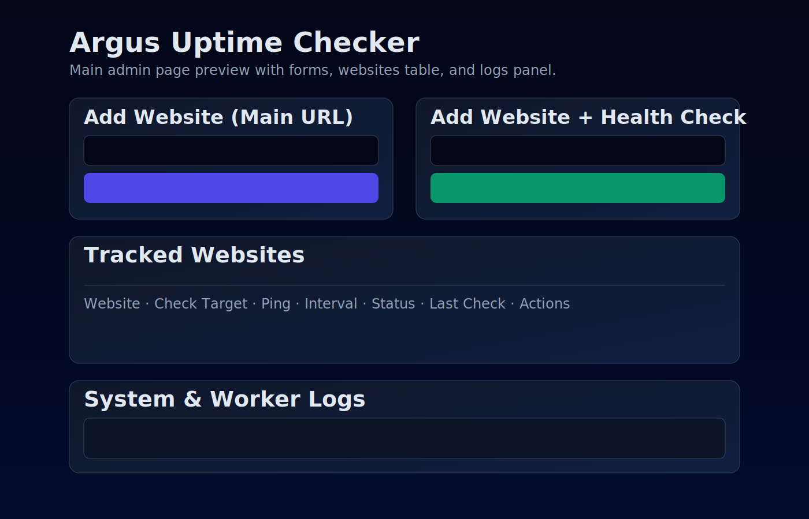

# Argus — Production-grade Uptime Monitoring Platform

Argus is a Go-based uptime monitoring service using Hexagonal Architecture (Ports & Adapters), MySQL, Redis/Asynq workers, and an outbox-driven alert integration model.

## Architecture (new)

- `cmd/api` — service entrypoint
- `internal/domain` — aggregates/entities/policies
- `internal/domain/ports` — repository + integration interfaces
- `internal/application` — use-cases/orchestration
- `internal/adapters/inbound` — HTTP/worker inbound adapters
- `internal/adapters/outbound` — MySQL, notifier and other outbound adapters
- `internal/platform` — framework/bootstrap/runtime wiring only
- `db/migrations` — versioned SQL migrations (up/down)
- `frontend` — separated UI assets

## Core capabilities

- Monitor types: `http_status`, `keyword`, `heartbeat`, `tls_expiry`
- Incident lifecycle + maintenance suppression
- Status pages
- Outbox-driven asynchronous alert dispatch with dedupe
- API key protection for API routes
- SSRF hardening for outbound checks

## Run locally

```bash
docker compose up -d
go run ./cmd/api
```

Open UI at: `http://localhost:8080`

## UI Preview



