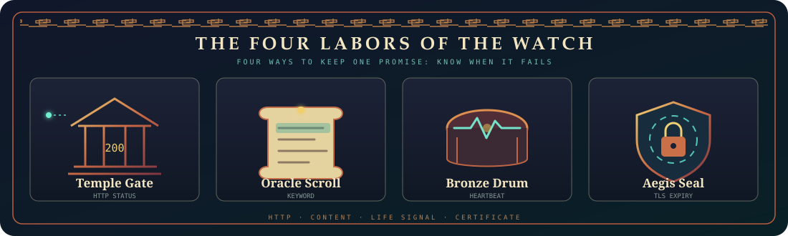
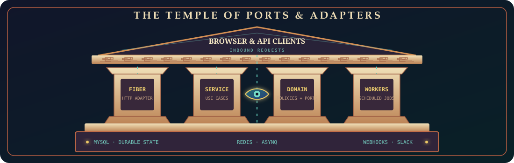

<div align="center">
  
</div>

<div align="center">

[](go.mod)
[](docker-compose.yml)
[](docker-compose.yml)
[](LICENSE)
[](CONTRIBUTING.md)

**A fast, self-hosted uptime monitor and incident control center built in Go.**

`PANOPTES MODE: ON` · Some eyes may rest. The watch never does.

[Quick start](#quick-start) · [Features](#what-argus-watches) · [API](#http-api) · [Architecture](#architecture) · [Roadmap](#project-status-and-roadmap) · [Contributing](CONTRIBUTING.md)

</div>

---

Argus watches websites, health endpoints, expected content, heartbeat signals, and TLS certificates. It records every check, opens and resolves incidents, suppresses noise during maintenance, and dispatches alerts asynchronously—all from a responsive dashboard you can run on your own infrastructure.

The name honors [Argus Panoptes](https://www.theoi.com/Gigante/GiganteArgosPanoptes.html)—the many-eyed, “all-seeing” guardian of Greek myth. Some of his eyes could sleep while others kept watch; after his death, Hera preserved them in the peacock’s tail. Argus turns that ancient image of continuous vigilance into a modern monitoring system.

> [!IMPORTANT]
> The website-monitoring workflow is the original production core. The newer **Projects + OpenAPI route monitoring** subsystem now also includes a background evaluator, aggregate metrics, project UI, and import wizard. A 2026 architecture review found that probing every imported route—especially state-changing methods—is not a safe or scalable default. See [Monitoring v2 design and delivery plan](#monitoring-v2-design-and-delivery-plan).

## Monitoring v2 design and delivery plan

The current route-monitoring implementation remains documented in
[PROJECT_MONITORING_PLAN.md](PROJECT_MONITORING_PLAN.md). The proposed next
generation uses passive OpenTelemetry data for broad endpoint coverage and
keeps active synthetic requests limited to explicit, safe canaries.

- [English transformation index](docs/audit-2026-07-28-en/README.md)
- [Product, UI/UX, system design, normalization, strategy, and Scrum blueprint](docs/audit-2026-07-28-en/ARGUS_TRANSFORMATION_BLUEPRINT.md)
- [Security best-practices review](docs/audit-2026-07-28-en/SECURITY_REVIEW.md)
- [Repository threat model](Argus-threat-model.md)
- [Motion audit and implementation plans](animation-plans/README.md)
- [Skills and plugins decision](docs/audit-2026-07-28-en/TOOLING_DECISION.md)
- [Research and standards register](docs/audit-2026-07-28-en/SOURCES.md)

## Why Argus?

- **Four monitoring modes** — HTTP status, response keyword, heartbeat, and TLS expiry.
- **Incident-aware by design** — failures open incidents; recoveries resolve them automatically.
- **Reliable alert delivery** — a transactional outbox decouples checks from webhook and Slack-compatible notifications.
- **Maintenance without blindness** — checks continue while alerts are muted for planned work.
- **Public status views** — group monitors into shareable status pages.
- **Operationally simple** — one Go process, MySQL for durable state, Redis/Asynq for scheduled work.
- **Secure defaults** — outbound target validation, metadata/private-network blocking, request body limits, security headers, hashed bearer tokens, and local-only OpenAPI reference resolution.
- **No frontend toolchain** — the dashboard is accessible, responsive vanilla HTML, CSS, and JavaScript served by the API process.

## Dashboard

The control center includes live health totals, searchable and sortable monitors, incident history, maintenance scheduling, alert channels, public status pages, ping history, toast feedback, light/dark themes, and a 30-second auto-refresh loop.

## What Argus watches

| Monitor | What it does | Healthy when |
| --- | --- | --- |
| `http_status` | Sends an HTTP `GET` to the target or optional health-check URL. | Response is `2xx` or `3xx`. |
| `keyword` | Reads up to 1 MiB of text/JSON response content. | The configured, case-sensitive keyword is present. |
| `heartbeat` | Waits for an external process to ping Argus. | The latest heartbeat is inside its grace period. |
| `tls_expiry` | Opens a TLS connection and inspects the leaf certificate. | Expiry is beyond the configured threshold (14 days by default). |

All monitor intervals must be at least 10 seconds. HTTP checks time out after 5 seconds; keyword checks after 6 seconds; TLS handshakes after 5 seconds.

<div align="center">
  
</div>

<div align="center">
  
</div>

### Incident and alert lifecycle

1. Asynq Scheduler periodically discovers due monitors.
2. Each monitor becomes a deduplicated job in the `critical` queue.
3. A bounded worker pool evaluates the target and persists its result.
4. A transition to `down` opens an incident; a transition to `up` resolves it.
5. When alerts are not suppressed by an active maintenance window, Argus writes a deduplicated outbox event.
6. The dispatcher delivers pending events to enabled webhook and Slack-compatible channels.

Email is represented in the data model and dashboard, but a delivery adapter has not been implemented yet.

## Quick start

### Prerequisites

- [Go 1.26.5](https://go.dev/doc/install) or a compatible newer release
- [Docker](https://docs.docker.com/get-docker/) with Docker Compose v2
- Free local ports `3306`, `6379`, and `8080`

### 1. Clone and start the data services

```bash
git clone https://github.com/Mersad-Moghaddam/Argus.git
cd Argus
docker compose up -d
docker compose ps
```

This starts MySQL 8.4, Redis 8.8, and VictoriaMetrics with persistent named
volumes. VictoriaMetrics is available only on local loopback at
`http://127.0.0.1:8428`; see [ADR 0001](docs/adr/0001-prometheus-compatible-metrics-store.md)
for retention, backup, restore, and production-access guidance.

### 2. Start Argus

```bash
go run ./cmd/api
```

The application connects to MySQL and Redis, applies every `*.up.sql` migration in lexical order, starts the scheduler and workers, and serves the dashboard at [http://localhost:8080](http://localhost:8080).

### 3. Create your first monitor

Use the **Add monitor** form in the dashboard, or call the API:

```bash
curl --request POST http://localhost:8080/monitor/websites \
  --header 'Content-Type: application/json' \
  --data '{
    "url": "https://example.com",
    "checkInterval": 30,
    "monitorType": "http_status"
  }'
```

If you configure `API_KEY`, also send `--header 'X-API-Key: your-secret-key'`. The dashboard can store that key in browser local storage for subsequent requests.

### Stop or reset

```bash
# Stop containers but keep monitoring data
docker compose down

# Remove containers and their MySQL/Redis volumes
docker compose down --volumes
```

> [!CAUTION]
> The second command permanently deletes local Argus data.

## Configuration

Argus reads environment variables and automatically loads a local `.env` file when present.

| Variable | Default | Purpose |
| --- | --- | --- |
| `HTTP_ADDR` | `:8080` | API and dashboard listen address. |
| `MYSQL_DSN` | `argus:argus@tcp(localhost:3306)/argus?parseTime=true` | Go MySQL driver DSN. Keep `parseTime=true`. |
| `REDIS_ADDR` | `localhost:6379` | Redis address used by Asynq. |
| `REDIS_PASSWORD` | empty | Redis password. |
| `REDIS_DB` | `0` | Redis logical database index. |
| `API_KEY` | empty | Optional `X-API-Key` required by the website-monitoring API. |
| `SCHEDULER_INTERVAL` | `30s` | How often Argus scans for due website checks. |
| `WORKER_CONCURRENCY` | `10` | Maximum concurrent Asynq jobs. |
| `QUEUE_CRITICAL_WEIGHT` | `6` | Relative capacity for monitor-check jobs. |
| `QUEUE_DEFAULT_WEIGHT` | `4` | Relative capacity for scheduling and outbox jobs. |
| `DUE_CHECK_BATCH_SIZE` | `200` | Reserved due-check batch setting; the current website processor uses batches of 200. |
| `DB_MAX_OPEN_CONNS` | `25` | Maximum open MySQL connections. |
| `DB_MAX_IDLE_CONNS` | `25` | Maximum idle MySQL connections. |
| `DB_CONN_MAX_LIFETIME` | `5m` | Maximum lifetime of a pooled connection. |
| `METRICS_BACKEND_URL` | `http://localhost:8428` | Internal VictoriaMetrics base URL for sanitized OTLP samples and future SLO queries. |
| `METRICS_BACKEND_TIMEOUT` | `5s` | Timeout for the VictoriaMetrics import request. |
| `SLO_EVALUATION_INTERVAL` | `1m` | How often the worker evaluates stored SLO definitions from the internal metrics backend. |
| `SLO_STALE_AFTER` | `10m` | Age after which the most recent telemetry sample produces a stale SLO result. |
| `RECOVERY_DELIVERY_URL` | empty | Optional operator-owned HTTPS webhook for password-recovery delivery. Argus sends the registered email, one-time reset token, and expiry; an empty value safely disables delivery. |
| `RECOVERY_DELIVERY_TIMEOUT` | `5s` | Maximum duration for the trusted recovery-delivery webhook. |
| `ROUTE_SECRET_ENCRYPTION_KEY` | empty | Base64-encoded 32-byte AES-256 key required to persist non-empty synthetic request headers. New writes use versioned AEAD ciphertext; keep this key in an operator-managed secret store. |

Example production-oriented `.env`:

```dotenv
HTTP_ADDR=:8080
MYSQL_DSN=argus:replace-me@tcp(mysql:3306)/argus?parseTime=true
REDIS_ADDR=redis:6379
REDIS_PASSWORD=replace-me
API_KEY=replace-with-a-long-random-secret
WORKER_CONCURRENCY=20
DB_MAX_OPEN_CONNS=40
```

Invalid integer or duration values fall back to defaults; an invalid `REDIS_DB` prevents startup. Go duration syntax such as `30s`, `5m`, or `1h` is accepted.

## HTTP API

Responses are JSON unless an endpoint returns `204 No Content`. Every Argus control-plane route uses `/family/purpose[/optional]`; the removed `/api/*` prefix is not accepted. The website API uses optional global API-key auth; the project API uses its own bearer-token sessions.

### Website monitoring API

When `API_KEY` is non-empty, include `X-API-Key: <key>` on every endpoint below.

| Method | Endpoint | Purpose |
| --- | --- | --- |
| `GET` | `/monitor/websites?limit=100&offset=0` | List monitors. |
| `POST` | `/monitor/websites` | Create a monitor. |
| `DELETE` | `/monitor/websites/:id` | Delete a monitor and its dependent history. |
| `POST` | `/monitor/heartbeat/:id` | Record a heartbeat. |
| `GET` | `/system/checks?limit=100` | Read recent check history. |
| `GET` | `/system/incidents?limit=100&offset=0` | Read incident history. |
| `POST` | `/notification/channels` | Create a webhook, Slack, or email channel. |
| `POST` | `/notification/maintenance` | Schedule alert suppression globally or for one monitor. |
| `GET` | `/status/pages?limit=100&offset=0` | List status pages. |
| `POST` | `/status/pages` | Create a status page. |
| `GET` | `/status/public/:slug` | Read a public status page payload. |
| `GET` | `/system/logs` | Read the in-memory operational log buffer. |

See the step-by-step [User Guide](USER_GUIDE.md) for request bodies and daily workflows.

### Projects and OpenAPI route API

This API is an **in-progress foundation** for multi-project route monitoring. Registration and login return an opaque token valid for 30 days. Argus stores only its SHA-256 hash.

```bash
# Register
curl --request POST http://localhost:8080/identity/register \
  --header 'Content-Type: application/json' \
  --data '{"email":"operator@example.com","password":"change-me-now","name":"Operator"}'

# Use the returned token
curl http://localhost:8080/project/catalog \
  --header 'Authorization: Bearer <token>'
```

| Area | Endpoints |
| --- | --- |
| Identity | `POST /identity/register`, `POST /identity/login`, `POST /identity/logout`, `GET /identity/profile` |
| Projects | `GET/POST /project/catalog`, `GET/PUT/DELETE /project/catalog/:projectId`, `/project/archive/:projectId`, and `/project/restore/:projectId` |
| Telemetry | Editor-only `GET/POST /telemetry/credentials/:projectId`, plus `/telemetry/rotate/:projectId/:credentialId` and `/telemetry/revoke/:projectId/:credentialId`. Any project viewer can read freshness diagnostics at `/telemetry/ingress/:projectId`. |
| Heartbeats | Viewer-readable `GET /heartbeat/catalog/:projectId`; editors create and revoke monitors with `POST /heartbeat/catalog/:projectId` and `POST /heartbeat/revoke/:projectId/:monitorId`. Jobs send `POST /heartbeat/ping` with the one-time Bearer token and a unique `Idempotency-Key`. |
| Routes | `/route/catalog/:projectId` for project-scoped list/create; focused family/purpose routes handle mutations, checks, incidents, and metrics. |
| Operational incidents | `GET /incident/catalog/:projectId` lists source-aware project incidents; editors acknowledge an open incident with `POST /incident/acknowledge/:projectId/:incidentId`. |
| Imports | `/import/validation/:projectId`, `/import/job/:projectId/:jobId`, and `/import/commit/:projectId/:jobId` support OpenAPI 3.x or Swagger 2.0 JSON/YAML documents up to 10 MiB. |

### OTLP/HTTP ingestion

Argus currently accepts OTLP protobuf exports at `POST /v1/metrics` and
`POST /v1/traces`. Send `Content-Type: application/x-protobuf` (or
`application/protobuf`) and `Authorization: Bearer <one-time-credential>`.
The credential, not the telemetry resource, selects the project and
environment. Resource metadata is treated as untrusted: only a bounded
`service.name` and `deployment.environment.name` diagnostic is retained for
mapping/freshness; raw attributes, URLs, measurements, span names, trace IDs,
and payloads are not written to MySQL. Each credential has a configured expiry
and per-minute request ceiling; requests above the ceiling receive `429`.
Project editors can create the credential from the **Telemetry signals** card;
the secret dialog is intentionally one-time and clears its displayed value when
it is dismissed.

Recognized HTTP server-duration histograms are written to VictoriaMetrics as
the `argus_http_server_request_duration_seconds` histogram family. The bridge
only allows the server-bound project/environment IDs, service identity,
deployment environment, HTTP method, normalized route template, status code,
and bucket boundary as labels. Other metrics remain visible only as bounded
ingestion diagnostics until Argus has an explicit safe translation for them.

Telemetry route mappings are a project-scoped control-plane API at
`GET/POST /telemetry/mappings/:projectId` (and
`DELETE /telemetry/mappings/:projectId/:mappingId`). A mapping
binds a catalog route to an existing project environment and service identity;
it cannot reference another project's route or environment.

OpenAPI imports resolve only local `$ref` pointers—Argus does not fetch external references. Import commits preserve user-owned monitoring configuration and disable, rather than delete, explicitly selected routes that disappeared from a specification.

### Project heartbeats

Project editors create a heartbeat for a selected environment and receive an
opaque `argus_hb_...` token once. Argus stores only its SHA-256 hash. A job
sends a ping with a fresh idempotency key for each run:

```bash
curl --request POST http://localhost:8080/heartbeat/ping \
  --header 'Authorization: Bearer argus_hb_...' \
  --header 'Idempotency-Key: nightly-backup-2026-07-29T00:00:00Z' \
  --header 'Content-Type: application/json' \
  --data '{"outcome":"success"}'
```

Only the bounded `success` or `failure` outcome is accepted; arbitrary run
metadata, logs, URLs, and payloads are not persisted. Repeating an idempotency
key returns an accepted response but deliberately does not refresh liveness.
The dashboard reports `healthy`, `late`, `missing`, or `revoked` from the
configured expected interval and grace period. Revocation immediately rejects
the old job token.

### Project incident evidence

Synthetic-route incidents now record their source (`synthetic`), stable source
key, and bounded evaluation evidence alongside the failure reason. Project
editors can acknowledge an open incident at
`POST /route/acknowledge/:projectId/:incidentId`; acknowledgement identifies
human attention but does not suppress recovery or resolve the incident. A
subsequent healthy evaluation resolves it normally. The source/evidence model
is additive and is the compatibility bridge for SLO, heartbeat, agent, and
pipeline incident producers.

Scheduled SLO evaluation also writes transactional-outbox intents only when an
SLO state changes. `slo_unhealthy` and `slo_recovered` are delivered through
the existing retryable notification workflow; repeated identical evaluations
do not generate notification noise.

### Private-agent enrollment and liveness

Project editors manage environment-bound private-agent identities through
`GET/POST /agent/catalog/:projectId` and
`POST /agent/revoke/:projectId/:agentId`. Creation returns an opaque
`argus_agent_...` enrollment token exactly once; Argus persists only its
SHA-256 hash. The creation payload accepts `expectedIntervalSeconds` (default
60; bounded to 15 seconds through 24 hours). Store the raw token in the
agent's local secret store and never place it in source control or a target
URL. Agent listings derive `healthy`, `stale`, `offline`, or `revoked` state
from that expectation and the most recent successful outbound heartbeat.

An agent reports outbound liveness and its version without exposing its local
network to the central service:

```bash
curl --request POST http://localhost:8080/agent/heartbeat \
  --header 'Authorization: Bearer argus_agent_...' \
  --header 'Content-Type: application/json' \
  --data '{"version":"1.0.0"}'
```

Project heartbeat monitors are evaluated every minute. A late or missing run
opens one source-aware operational incident; the incident resolves when a new,
non-duplicate heartbeat is received. This liveness state is separate from the
job's optional `success` or `failure` outcome.

The service returns the agent's server-bound project and environment identity;
the agent must not select those values itself. Revocation immediately rejects
the credential, and project non-members receive a non-enumerating response.
When `AGENT_CONFIG_SIGNING_KEY` is configured, an enrolled agent can also call
`GET /agent/config` with its Bearer token. Argus returns a 15-minute,
Ed25519-signed identity/liveness envelope bound to that token's server-side
project and environment. It contains no private target, executable work, or
reverse-connect instruction; without the signing key this route fails closed.
Provision the matching base64url public key to the agent as
`ARGUS_AGENT_CONFIG_PUBLIC_KEY`; it verifies the envelope before adopting the
server-bound heartbeat interval.
The included `argus-agent` process is an outbound-only liveness client:

```bash
ARGUS_AGENT_CONTROL_URL=https://argus.example.com \
ARGUS_AGENT_TOKEN=argus_agent_... \
go run ./cmd/argus-agent -heartbeat-interval=60s
```

It requires HTTPS except for loopback development, has a 10-second request
timeout, validates a 15-second-to-24-hour heartbeat interval, and never logs
the credential. The project dashboard exposes enrollment, one-time token
copying, last-seen/version, healthy/stale/offline/revoked state, and guarded
revocation. The packaged local executor, signed work configuration, and
private result protocol are tracked as follow-up work. Argus does not
reverse-connect or dial customer-private addresses.

## Architecture

Argus follows a ports-and-adapters layout: business rules point inward, while HTTP, MySQL, Redis/Asynq, and outbound notifications remain replaceable edge concerns.

<div align="center">
  
</div>

```text
Browser / API clients
        │
        ▼
Fiber HTTP adapter ─────────────── Static dashboard
        │
        ▼
Application services ──────────── OpenAPI parser
        │
        ▼
Domain policies + ports
        │
        ├──────── MySQL adapters ─── durable state + outbox
        ├──────── Asynq workers ──── Redis scheduling/queues
        └──────── HTTP notifier ──── webhooks / Slack
```

| Path | Responsibility |
| --- | --- |
| `cmd/api` | Process entrypoint and graceful shutdown. |
| `internal/domain` | Pure validation, health-state, and incident policies. |
| `internal/domain/ports` | Storage and integration contracts. |
| `internal/application` | Use cases for monitors, incidents, auth, projects, routes, and imports. |
| `internal/adapters/inbound` | Fiber authentication middleware. |
| `internal/adapters/outbound` | MySQL repositories and outbound notification delivery. |
| `internal/api` | HTTP handlers and endpoint registration. |
| `internal/openapi` | Bounded OpenAPI 3.x / Swagger 2.0 JSON/YAML parsing and local reference resolution. |
| `internal/platform` | MySQL, migrations, Fiber, Redis, and Asynq runtime wiring. |
| `internal/worker` | Scheduled website evaluation and outbox processing. |
| `db/migrations` | Ordered, additive MySQL schema migrations. |
| `frontend` | Dependency-free dashboard assets. |

## Data and migrations

- MySQL persists monitors, checks, incidents, maintenance windows, status pages, alert channels, the outbox, users, projects, API routes, route checks/incidents, and import jobs.
- Redis contains Asynq queues and scheduler state; it is not the source of truth for monitoring history.
- Startup applies all `db/migrations/*.up.sql` files in filename order.
- Duplicate-column error `1060` is treated as an idempotent compatibility case.
- Down migrations exist for controlled development rollback, but startup never applies them automatically.

### Canonical endpoint identity backfill

After migration `0006_endpoint_identity.up.sql` is applied, convert legacy API
routes with the operator command below. Start with `-dry-run`; invalid legacy
values and normalization collisions are recorded in
`route_canonicalization_conflicts` for review, while valid rows are converted
in bounded, restartable batches.

```bash
DATABASE_DSN='user:password@tcp(127.0.0.1:3306)/argus?parseTime=true' \
  go run ./cmd/backfill-endpoint-identity -dry-run

DATABASE_DSN='user:password@tcp(127.0.0.1:3306)/argus?parseTime=true' \
  go run ./cmd/backfill-endpoint-identity -batch-size 200
```

Named Docker volumes retain both MySQL and Redis state across container restarts.

## Security model

Argus is intended to monitor public network targets. Before direct HTTP and keyword checks, it resolves the hostname and blocks loopback, RFC1918/private, link-local, and cloud metadata addresses. Additional safeguards include:

- optional global API-key protection through Fiber middleware;
- independent bearer auth for project APIs, bcrypt password hashing, hashed session tokens, and role-aware project authorization;
- generic `404` responses for unauthorized/nonexistent projects to reduce enumeration;
- a 15 MiB HTTP body limit and 10 MiB OpenAPI document limit;
- local-only `$ref` resolution and YAML structural limits;
- 1 MiB response read caps for HTTP content checks;
- Fiber recovery, Helmet security headers, ETags, and response compression.

> [!WARNING]
> Treat Argus as privileged infrastructure. Put it behind TLS and a trusted reverse proxy, set `API_KEY`, use strong MySQL/Redis credentials, restrict database ports, and review outbound-network policy before exposing it publicly. The newer route evaluator revalidates redirect hops and resolved addresses; the legacy website checker still uses a less-hardened client and should not be treated as equivalent.

Please report vulnerabilities privately according to [SECURITY.md](SECURITY.md).

## Development

```bash
# Run all unit tests
go test ./...

# Run race detection
go test -race ./...

# Static analysis
go vet ./...

# Optional linting (requires revive)
revive -config revive.toml ./...
```

The current suite covers domain policies, migration error handling, OpenAPI/Swagger parsing and reference resolution, large/malformed document limits, and metadata-target blocking.

### Useful local checks

```bash
gofmt -w $(git ls-files '*.go')
go build ./...
docker compose logs -f mysql redis
```

## Production checklist

- [ ] Set a long, random `API_KEY`.
- [ ] Replace all example MySQL and Redis credentials.
- [ ] Terminate TLS at a reverse proxy and restrict trusted inbound traffic.
- [ ] Do not expose MySQL (`3306`) or Redis (`6379`) to the public internet.
- [ ] Use durable, backed-up storage for MySQL.
- [ ] Tune worker concurrency, queue weights, and DB pooling for your workload.
- [ ] Add process supervision, health probes, centralized logs, and metrics.
- [ ] Pin and regularly update container images and Go dependencies.
- [ ] Test restore, migration, incident, maintenance, and alert-delivery workflows.

## Project status and roadmap

| Capability | Status |
| --- | --- |
| Website/keyword/heartbeat/TLS monitoring | Available |
| Check history, incidents, maintenance, status pages | Available |
| Webhook and Slack-compatible outbox delivery | Available |
| Responsive website-monitoring dashboard | Available |
| Project users, roles, CRUD, route CRUD | Available |
| OpenAPI 3.x / Swagger 2.0 import preview and commit | Available |
| Project route-check worker and aggregate metrics | Available; redesign proposed |
| Project dashboard and import wizard | Available; UX redesign proposed |
| Monitoring v2 telemetry, SLOs, and budgeted canaries | Proposed |
| Email delivery adapter | Planned |
| Expanded integration/E2E coverage and observability | Planned |

The implementation history lives in [PROJECT_MONITORING_PLAN.md](PROJECT_MONITORING_PLAN.md). The English product and architecture package starts at [docs/audit-2026-07-28-en/README.md](docs/audit-2026-07-28-en/README.md). Broader modernization notes remain in [REWRITE_ROADMAP.md](REWRITE_ROADMAP.md).

## Contributing

Issues, focused pull requests, tests, documentation, and design discussion are welcome. Start with [CONTRIBUTING.md](CONTRIBUTING.md), follow the [Code of Conduct](CODE_OF_CONDUCT.md), and check the roadmap before beginning a large change.

When proposing a feature, explain the operational problem it solves, its failure modes, and how it preserves the domain/ports boundary.

## Support

- Read the [User Guide](USER_GUIDE.md).
- Search or open a [GitHub issue](https://github.com/Mersad-Moghaddam/Argus/issues).
- Use [GitHub Discussions](https://github.com/Mersad-Moghaddam/Argus/discussions) for ideas and architecture questions when enabled.
- Follow [SECURITY.md](SECURITY.md) for sensitive reports.

## License

Argus is available under the [MIT License](LICENSE).

## Acknowledgements

Argus is powered by [Fiber](https://gofiber.io/), [Asynq](https://github.com/hibiken/asynq), [go-sql-driver/mysql](https://github.com/go-sql-driver/mysql), [go-redis](https://github.com/redis/go-redis), and the wider Go open-source ecosystem.

<div align="center">
  <sub>Built for operators who prefer quiet systems—and fast answers when they are not.</sub>
</div>
