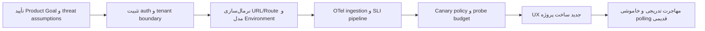

# نقشه‌ی تحول Argus: تجربه‌ی کاربری و Monitoring v2

تاریخ ارزیابی: ۲۰۲۶-۰۷-۲۸
مبنای کد: `b576998`
وضعیت: سند تصمیم و برنامه‌ی اجرا؛ هیچ تغییر محصولی در این شاخه اعمال نشده است.

## تصمیم خلاصه

Argus باید از «ارسال درخواست فعال به تک‌تک routeها» به یک معماری **ترکیبی** مهاجرت کند:

1. **تله‌متری غیرفعال OpenTelemetry** منبع پیش‌فرض سلامت همه‌ی endpointها باشد.
2. **Synthetic monitoring** فقط برای تعداد کمی canary ایمن، کم‌هزینه و صریحاً فعال‌شده استفاده شود.
3. **Heartbeat** برای jobها و پردازش‌های زمان‌بندی‌شده باقی بماند.
4. در صورت نیاز، **RUM** تجربه‌ی واقعی مرورگر را تکمیل کند.

در محصول نیز احراز هویت باید یک قابلیت سراسری باشد، نه زیرقابلیت Projects. کاربر مهمان ابتدا ثبت‌نام یا ورود می‌کند و سپس همه‌ی ابزارهای خصوصی را در یک فضای project-scoped می‌بیند. status pageهای عمومی تنها استثنای عمومی باقی می‌مانند.

## بسته‌ی مستندات

| سند | مخاطب | تصمیم/خروجی |
|---|---|---|
| [ممیزی محصول، UI/UX و فلوها](reviews/2026-07-28-product-ux-audit.fa.md) | محصول، طراحی، فرانت‌اند | معماری اطلاعات، فلوهای auth و ساخت پروژه، user story، wireframe، دسترس‌پذیری |
| [ADR معماری Monitoring v2](architecture/MONITORING_V2_ADR.fa.md) | معماری، بک‌اند، SRE | مقایسه‌ی گزینه‌ها، معماری منتخب، SLI/SLO، migration و inventory تغییرات |
| [قرارداد نرمال‌سازی URL و Route](architecture/URL_ROUTE_NORMALIZATION_SPEC.fa.md) | بک‌اند، API، داده | الگوریتم canonicalization، preview API، fingerprint، backfill و تست‌ها |
| [برنامه‌ی Scrum](planning/MONITORING_V2_SCRUM_PLAN.fa.md) | Product Owner، Scrum Team | Product Goal، epic/story، acceptance criteria، sprintها، DoD و release gate |
| [گزارش امنیت](../security_best_practices_report.md) | امنیت و توسعه | یافته‌های اولویت‌بندی‌شده و اصلاحات پیشنهادی |
| [Threat model](../Argus-threat-model.md) | امنیت، معماری، عملیات | مرزهای اعتماد، دارایی‌ها، abuse pathها و کنترل‌ها |
| [ممیزی و برنامه‌ی حرکت](../animation-plans/README.md) | طراحی و فرانت‌اند | واژگان دقیق motion، اولویت‌ها و برنامه‌های اجرای مستقل |
| [ابزارها و پلاگین‌ها](research/TOOLING_RECOMMENDATIONS.fa.md) | تیم توسعه | مهارت نصب‌شده، گزینه‌های رد/پیشنهادشده و ملاحظات زنجیره تأمین |

## ترتیب تصمیم و اجرا

## پنج شرط غیرقابل مصالحه

1. import کردن OpenAPI نباید به‌طور خودکار درخواست `POST`، `PATCH`، `PUT` یا `DELETE` ارسال کند.
2. session یا API key حساس نباید در `localStorage` نگهداری شود.
3. normalization جایگزین SSRF defense نیست؛ مقصد در هر DNS resolution و redirect دوباره اعتبارسنجی می‌شود.
4. هیچ metric dimension نباید از raw URL/path با cardinality نامحدود ساخته شود؛ `http.route` باید template پایدار باشد.
5. عرضه‌ی Monitoring v2 تنها پس از اثبات کاهش بار outbound، صحت SLO و rollback موفق انجام می‌شود.

## وضعیت تصمیم‌ها

| موضوع | وضعیت | مالک پیشنهادی |
|---|---|---|
| معماری ترکیبی OTel + Synthetic محدود | پیشنهاد نهایی برای تصویب | Tech Lead / SRE |
| auth سراسری و project-scoped | پیشنهاد نهایی برای تصویب | Product + Security |
| cookie session برای مرورگر و project token برای automation | پیشنهاد نهایی برای تصویب | Backend + Security |
| قرارداد normalization | آماده‌ی refinement فنی | Backend |
| Scrum backlog | آماده‌ی estimation تیم | Product Owner + Developers |
| wireframeها | آماده‌ی تبدیل به prototype | Product Designer |
