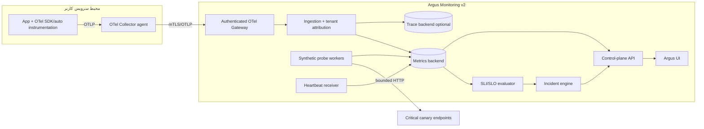
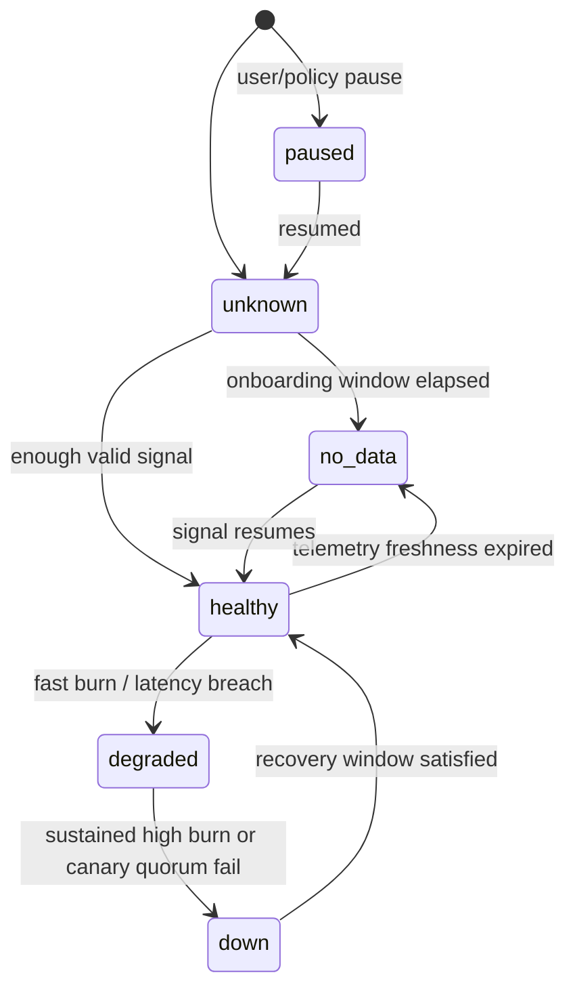

# ADR: معماری Monitoring v2 برای Argus

- وضعیت: Proposed
- تاریخ: ۲۰۲۶-۰۷-۲۸
- تصمیم‌گیرندگان پیشنهادی: Product Owner، Tech Lead، SRE، Security
- مبنای کد: `b576998`
- جایگزین سند قبلی نیست: `PROJECT_MONITORING_PLAN.md` تاریخچه‌ی پیاده‌سازی فعلی را حفظ می‌کند؛ این ADR هدف نسل بعدی است.

## ۱. زمینه و مسئله

Argus امروز برای routeهای API یک job زمان‌بندی می‌کند و درخواست HTTP واقعی با method همان route می‌فرستد:

- scheduler هر ۱۵ ثانیه routeهای due را scan می‌کند: `internal/config/config.go:53-58`;
- evaluator برای هر route تا `retries + 1` بار درخواست می‌فرستد: `internal/worker/route_evaluator.go:289-330`;
- body ارسال نمی‌شود، حتی برای methodهایی که معمولاً body لازم دارند: `internal/worker/route_evaluator.go:315-330`;
- import همه‌ی routeهای انتخاب‌شده را `Enabled: true` می‌سازد: `internal/application/imports.go:181-192`;
- methodهای `POST`, `PUT`, `PATCH`, `DELETE`, `TRACE` نیز قابل مانیتور هستند: `internal/domain/route.go:95-104`.

این مدل برای چند health endpoint یا canary کنترل‌شده مناسب است، اما برای «همه‌ی routeهای یک API» اصولی نیست:

1. بار مصنوعی متناسب با تعداد routeها رشد می‌کند.
2. request تغییردهنده می‌تواند داده/سفارش/حساب بسازد یا حذف کند.
3. پاسخ بدون request fixture الزاماً نشانه‌ی availability واقعی نیست.
4. retry روی POST/PATCH می‌تواند اثر جانبی را تکرار کند.
5. مسیرهای template با مقدار مصنوعی ممکن است پوشش معنادار نداشته باشند.
6. مراقبت از auth header، SSRF، redirect و secretها پیچیدگی امنیتی دائمی می‌سازد.

## ۲. برآورد بار فعلی

فرمول ساده:

```text
attempts_per_minute =
  enabled_routes × (60 / interval_seconds) × (1 + retries) × locations
```

این عدد redirectها، DNS، TLS handshake و UI polling را حساب نمی‌کند.

| سناریو | route | interval | retry | location | attempt/min |
|---|---:|---:|---:|---:|---:|
| پروژه‌ی کوچک پیش‌فرض | 50 | 300s | 1 | 1 | 20 |
| import متوسط پیش‌فرض | 1,000 | 300s | 1 | 1 | 400 |
| سقف import فعلی، پیش‌فرض | 5,000 | 300s | 1 | 1 | 2,000 |
| سقف پرریسک | 5,000 | 10s | 5 | 1 | 180,000 |
| همان، سه location | 5,000 | 10s | 5 | 3 | 540,000 |

evaluator تا ۵ redirect را می‌پذیرد؛ بنابراین سناریوی تک-location پرریسک از نظر نظری می‌تواند تا حدود ۱.۰۸ میلیون exchange HTTP در دقیقه ایجاد کند، هرچند worker concurrency و backlog نرخ لحظه‌ای را محدود می‌کنند. محدودشدن با backlog خود یک مشکل است: checkها دیر می‌شوند و status دیگر زمان واقعی را نمایندگی نمی‌کند.

## ۳. نیروهای تصمیم

- پوشش همه‌ی routeها بدون تولید traffic مصنوعی متناسب با route count؛
- تشخیص availability در نبود traffic؛
- حفظ self-hosted و vendor-neutral بودن؛
- سازگاری با Go/Fiber، MySQL، Redis/Asynq و Docker Compose فعلی؛
- multi-tenant isolation و cardinality control؛
- SLO و alert با false-positive پایین؛
- rollout تدریجی بدون big-bang migration؛
- هزینه‌ی عملیاتی قابل فهم برای تیم کوچک؛
- امکان monitor کردن target خصوصی با agent داخل شبکه، بدون بازکردن SSRF در control plane.

## ۴. گزینه‌های بررسی‌شده

| گزینه | پوشش | بار روی target | تشخیص no-traffic | پیچیدگی | نتیجه |
|---|---|---:|---|---|---|
| A. ادامه‌ی probe همه‌ی routeها | ظاهراً بالا، معنای کم | بسیار بالا | بله | متوسط ولی پرریسک | رد |
| B. فقط `/health` و `/ready` | سلامت process/dependency | کم | بله | کم | لازم ولی ناکافی |
| C. Prometheus pull از service metrics | RED metrics خوب | بسیار کم | no-traffic قابل تشخیص است، availability نه | متوسط | مناسب در شبکه‌ی کنترل‌شده؛ تنها گزینه نیست |
| D. OTel push/Collector | RED + trace + logs، vendor-neutral | بسیار کم | state `no_data` | متوسط | هسته‌ی منتخب |
| E. eBPF/sidecar بدون instrumentation | پوشش شبکه‌ای خوب | کم | no-traffic | بالا و platform-dependent | گزینه‌ی آینده |
| F. فقط log ingestion | قابل شروع | کم | no-traffic | parsing/cardinality سخت | fallback، نه source اصلی |
| G. Synthetic canary محدود | journey واقعی | کم و بودجه‌پذیر | بله | متوسط | مکمل منتخب |
| H. RUM | تجربه‌ی واقعی browser | صفر server probe | وابسته به کاربر | متوسط | مکمل اختیاری |

### چرا فقط health endpoint کافی نیست؟

`/live` نشان می‌دهد process زنده است؛ `/ready` نشان می‌دهد آماده‌ی دریافت traffic است. هیچ‌کدام error rate یا latency routeهای واقعی را ثابت نمی‌کنند. در مقابل، telemetry بدون traffic نمی‌تواند availability بیرونی را اثبات کند. پس ترکیب telemetry و canary لازم است.

### چرا Prometheus Blackbox به‌تنهایی انتخاب نشد؟

Blackbox exporter ابزار استاندارد multi-target probe است و برای canary مناسب باقی می‌ماند، اما اگر همان فهرست هزاران route به آن داده شود، مشکل بار فقط جابه‌جا می‌شود. نقش آن در معماری هدف «probe runner محدود» است، نه منبع پوشش همه‌ی routeها.

## ۵. تصمیم

Argus Monitoring v2 یک معماری **Hybrid Observability + Deliberate Synthetics** خواهد بود.

### ۵.۱ چهار منبع signal

1. **Telemetry**
   - منبع پیش‌فرض endpoint health؛
   - RED: request rate، error rate، duration؛
   - attributes کم‌cardinality بر اساس route template؛
   - traces اختیاری برای تشخیص علت.
2. **Synthetic**
   - فقط canaryهای صریحاً انتخاب‌شده؛
   - safe method به‌صورت پیش‌فرض؛
   - بودجه‌ی per-origin، jitter، backoff و location policy.
3. **Heartbeat**
   - deadline-based برای cron/worker/job؛
   - missing heartbeat یک signal مستقل.
4. **RUM**
   - اختیاری برای browser journey، Core Web Vitals و خطای frontend؛
   - با privacy/sampling مشخص.

### ۵.۲ معماری منطقی



### ۵.۳ deployment پیشنهادی

- Collector agent نزدیک workload برای batching، retry و کاهش coupling.
- gateway مرکزی Argus برای authentication، tenant attribution، filtering و export.
- `memory_limiter`، `batch` و persistent sending queue در Collector.
- OTLP/gRPC یا OTLP/HTTP با TLS؛ endpoint عمومی بدون auth ممنوع.
- metric backend سازگار با Prometheus (شروع می‌تواند Prometheus باشد؛ برای retention/scale بعداً Mimir/Thanos/VictoriaMetrics قابل بررسی است).
- trace backend اختیاری، مثلاً Tempo؛ فعال‌سازی با sampling و سقف هزینه.
- در Docker Compose یک gateway و backend تک‌نمونه برای MVP؛ HA پس از load test.

## ۶. قرارداد telemetry و کنترل cardinality

### Resource attributes مجاز

```text
service.name
service.namespace
service.version
deployment.environment.name
cloud.region / k8s.cluster.name (در صورت وجود)
argus.project.id          ← توسط gateway از credential معتبر تزریق شود
argus.environment.id      ← توسط gateway تزریق/اعتبارسنجی شود
```

client نباید بتواند `argus.project.id` دلخواه را قابل اعتماد جلوه دهد؛ gateway آن را overwrite می‌کند.

### HTTP metric dimensions

```text
http.request.method
http.response.status_code
http.route               ← template مثل /orders/{orderId}
error.type               ← bounded
network.protocol.version ← در صورت نیاز
```

ممنوع:

- `url.full`، raw path شامل ID، query string، email، tenant slug یا trace ID به‌عنوان label؛
- exception message آزاد؛
- user ID، IP کاربر یا header حساس؛
- operation name بدون allowlist.

### metrics مشتق‌شده

- `argus_http_requests_total`;
- `argus_http_errors_total`;
- `argus_http_server_duration_seconds` histogram؛
- `argus_endpoint_last_seen_timestamp_seconds`;
- `argus_synthetic_attempts_total`;
- `argus_synthetic_duration_seconds`;
- `argus_heartbeat_last_seen_timestamp_seconds`.

ترجیح این است که تا حد ممکن semantic conventionهای استاندارد OTel مستقیم مصرف شوند و نام‌های Argus فقط برای recording ruleهای مشتق‌شده باشند.

## ۷. مدل سلامت و SLI/SLO

### state machine



`no_data` مساوی `down` نیست. alert آن باید بر اساس criticality و انتظار traffic باشد.

### availability SLI

```text
good events =
  requests whose status is not considered an availability failure

valid events =
  total requests minus explicitly excluded traffic

availability = good / valid
```

Exclusionها باید versioned و auditشده باشند؛ مثلاً 4xx ناشی از client ممکن است good یا neutral باشد، اما 429 بسته به SLO محصول تصمیم جدا می‌خواهد.

### latency SLI

دو روش مجاز:

- proportion of requests زیر threshold؛ برای alert/SLO شفاف‌تر؛
- percentile برای dashboard، نه به‌تنهایی برای error-budget math.

### alerting

- multi-window, multi-burn-rate بر اساس error budget؛
- page برای burn شدید کوتاه‌مدت + تأیید window بلندتر؛
- ticket برای burn کند؛
- canary alert با quorum مکانی، نه failure منفرد؛
- maintenance و deploy annotation در incident context، نه suppression کور همه‌ی signalها.

نمونه‌ی سیاست مفهومی:

| شدت | window کوتاه | window بلند | burn | عمل |
|---|---|---|---:|---|
| Page | 5m | 1h | 14.4× | on-call |
| Page | 30m | 6h | 6× | on-call |
| Ticket | 2h | 1d | 3× | backlog فوری |
| Ticket | 6h | 3d | 1× | بررسی ظرفیت |

عددهای نهایی با SLO و traffic هر سرویس validate می‌شوند؛ این جدول template است.

## ۸. سیاست Synthetic

### پیش‌فرض امن

- import/create: `synthetic_enabled=false`;
- GET و HEAD تنها methodهای معمول قابل پیشنهاد؛
- OPTIONS فقط با دلیل مشخص؛ TRACE در محصول غیرفعال؛
- POST/PUT/PATCH/DELETE در production از UI استاندارد ممنوع.

### استثنای state-changing journey

فقط اگر همه‌ی موارد برقرار باشند:

1. environment غیر production یا tenant sandbox؛
2. request fixture versioned؛
3. idempotency key و semantics مستند؛
4. cleanup/compensation معتبر؛
5. credential با کمترین scope؛
6. data marker برای حذف test data؛
7. approval دو نفره برای production exception؛
8. سقف نرخ سخت و kill switch.

### scheduler

- token bucket per origin/project/location؛
- global concurrency cap؛
- jitter برای حذف thundering herd؛
- exponential backoff با سقف؛
- احترام به `Retry-After`;
- circuit breaker برای origin ناسالم؛
- deadline و response body cap؛
- fair queue بین tenantها؛
- freshness SLO برای خود scheduler.

### multi-location

- canary critical حداقل دو location مستقل؛
- incident وقتی quorum fail شود یا یک location failure پایدار داشته باشد؛
- خطای DNS/TLS/network به‌صورت failure class ذخیره شود؛
- clock skew و location health پیش از نسبت‌دادن failure به target بررسی شود.

## ۹. امنیت و target خصوصی

### control plane

- هیچ control-plane worker عمومی نباید صرفاً با flag عمومی به شبکه خصوصی مشتری دسترسی داشته باشد.
- برای private target یک probe agent داخل شبکه‌ی مشتری اجرا شود و outbound connection به Argus داشته باشد.
- jobهای probe امضاشده، scopeشده و short-lived باشند.
- secretها در vault/encrypted store؛ UI فقط metadata/last rotated را ببیند.

### SSRF

route evaluator جدید چند کنترل خوب دارد: محدودیت scheme/IP، dial-time validation، redirect revalidation و حذف secret در cross-origin redirect. evaluator legacy در `internal/worker/processor.go:154-185` از `http.DefaultClient` استفاده می‌کند و باید به همان transport امن یا agent model منتقل شود.

Normalization امنیت محسوب نمی‌شود. DNS باید در زمان dial resolve و هر IP بررسی شود؛ redirect نیز دوباره validate شود.

## ۱۰. مدل داده‌ی هدف

```text
users
organizations (optional phase)
projects
project_members
environments
  id, project_id, name, canonical_base_url, policy_id

endpoint_definitions
  id, project_id, method, canonical_template, structural_fingerprint, source

monitor_policies
  id, endpoint_id/environment_id, source_type,
  synthetic_enabled, interval, locations, budget, slo_id

telemetry_sources
  id, project_id, environment_id, credential_hash, last_seen_at, status

slo_definitions
  id, project_id, indicator, target, window, exclusions_version

signal_samples / rollups
incidents
incident_events
probe_agents
probe_locations
```

جداسازی `endpoint_definition` از `monitor_policy` ضروری است: یک endpoint می‌تواند از telemetry دیده شود، synthetic نداشته باشد، و همچنان در catalog وجود داشته باشد.

## ۱۱. تغییرات لازم در مخزن

### Domain

| مسیر | تغییر |
|---|---|
| `internal/domain/route.go` | تبدیل route به endpoint definition؛ source/state جدید؛ حذف enable ضمنی |
| `internal/domain/entities.go` | یکپارچه‌سازی URL value object و حذف parser موازی |
| فایل جدید `internal/domain/monitoring.go` | policy، signal source، health state، SLO/burn rules |
| فایل جدید `internal/domain/environment.go` | canonical base URL و environment policy |

### Application

| مسیر | تغییر |
|---|---|
| `internal/application/routes.go` | استفاده از normalization service؛ create catalog disabled؛ validate preview |
| `internal/application/imports.go` | import بدون probe؛ conflict بر fingerprint ساختاری |
| `internal/application/projects.go` | creation ساده و افزودن environment/source جدا |
| `internal/application/auth.go` | browser session lifecycle، capability response، revoke/rotate |
| فایل‌های جدید | telemetry source registration، SLO service، canary policy و onboarding |

### Inbound API

| مسیر | تغییر |
|---|---|
| `internal/api/auth_handler.go` | cookie session، CSRF، profile/capabilities، verify/reset flow |
| `internal/adapters/inbound/http/middleware.go` | auth واحد برای private API، tenant context، rate limit |
| `internal/platform/httpserver/fiber.go` | `/api/v2`، OTLP gateway boundary یا proxy، timeouts/limits |
| handlers جدید | environments، endpoint validation، telemetry setup، SLO، monitor policies |

### Outbound/Data

| مسیر | تغییر |
|---|---|
| `db/migrations/` | جداول environment/source/policy/SLO؛ project ownership برای legacy؛ backfill و aliases |
| `internal/adapters/outbound/mysql/` | repositoryهای جدید و queryهای tenant-scoped |
| `internal/platform/storage/` | metric backend client یا query adapter |

### Worker

| مسیر | تغییر |
|---|---|
| `internal/worker/route_evaluator.go` | تبدیل به canary evaluator؛ safe-method policy و budget |
| `internal/worker/processor.go` | حذف `http.DefaultClient` و مهاجرت legacy به transport مشترک/agent |
| `internal/platform/worker/` | queueهای telemetry rollup، SLO evaluation و incident transition |
| scheduler فعلی | فقط monitor_policyهای synthetic-enabled؛ fairness/jitter/token bucket |

### Frontend

| مسیر | تغییر |
|---|---|
| `frontend/index.html` | auth سراسری، IA جدید، wizard environment/source/review |
| `frontend/projects.js` | حذف localStorage auth؛ endpoint catalog و policy UI |
| `frontend/app.js` | حذف API key header UI؛ session-aware BFF refresh؛ کاهش polling |
| `frontend/styles.css` | token contrast، dialog/a11y، motion plans |

### Deployment/Operations

- افزودن OTel Collector gateway config؛
- metrics backend و retention config؛
- TLS/mTLS یا signed tenant credentials؛
- dashboards برای ingestion lag، dropped spans/metrics، queue age و cardinality؛
- canary location identity و health؛
- backup/restore برای config و SLO، نه لزوماً raw high-volume telemetry در MySQL؛
- runbook incident خود Argus.

## ۱۲. migration و rollout

### Phase 0 — Guardrail فوری

- همه‌ی import/createهای جدید synthetic-disabled.
- unsafe methods blocked.
- global concurrency/rate caps.
- feature flag برای Monitoring v2.

### Phase 1 — Foundation

- auth/tenant و environment model؛
- URL normalization/backfill؛
- endpoint catalog جدا از active monitor.

### Phase 2 — Telemetry shadow

- gateway و metrics backend؛
- ingest بدون اثر روی incident فعلی؛
- مقایسه‌ی telemetry health با probe health.

### Phase 3 — SLO shadow

- محاسبه burn rate و incident candidate بدون notification؛
- false-positive/false-negative review.

### Phase 4 — Canary migration

- هر project فقط critical canaryهای منتخب؛
- old route checks کاهش تدریجی؛
- unsafe checks حذف یا sandbox-only.

### Phase 5 — Cutover

- incident source برای projectهای opted-in به v2؛
- rollback switch تا دو release؛
- پاک‌سازی scheduler و جداول legacy پس از retention window.

## ۱۳. Release gates

- هیچ cross-tenant telemetry در تست و audit؛
- cardinality budget violation = صفر در soak test؛
- ingestion p99 lag زیر هدف مصوب؛
- dropped telemetry زیر 0.1% در load envelope؛
- canary request budget سخت و قابل مشاهده؛
- SLO shadow حداقل ۱۴ روز؛
- incident parity برای سناریوهای تزریق خطا؛
- rollback تست‌شده؛
- runbook و on-call dashboard آماده؛
- UX/a11y acceptance از سند ممیزی پاس شده.

## ۱۴. پیامدها

### مثبت

- بار probe از O(routes) به O(canaries) کاهش می‌یابد.
- coverage routeهای پرترافیک با داده‌ی واقعی افزایش می‌یابد.
- SLO به‌جای thresholdهای پراکنده مرکز alerting می‌شود.
- مدل vendor-neutral و self-hosted حفظ می‌شود.
- private monitoring با agent امن‌تر می‌شود.

### هزینه/ریسک

- Collector و metrics backend اجزای عملیاتی جدید هستند.
- onboarding مشتری نیازمند instrumentation است.
- telemetry در no-traffic availability را ثابت نمی‌کند.
- cardinality و tenant attribution باید بسیار سخت‌گیرانه طراحی شوند.
- migration dual-read و shadow evaluation پیچیدگی موقت دارد.

## ۱۵. گزینه‌های باز برای refinement

- تک‌کاربر self-hosted یا SaaS چندمستاجری؛ ADR بدترین حالت multi-tenant را مبنا گرفته است.
- نیاز قطعی به private target؛ اگر بله، agent از MVP یا sprint بعدی؟
- retention و الزام حقوقی/منطقه‌ای telemetry.
- metrics backend MVP و scale target.
- مدل organization/team و billing.

## منابع رسمی

- [OpenTelemetry signals](https://opentelemetry.io/docs/concepts/signals/)
- [OpenTelemetry Collector deployment patterns](https://opentelemetry.io/docs/collector/deployment/)
- [OpenTelemetry gateway deployment](https://opentelemetry.io/docs/collector/deploy/gateway/)
- [OpenTelemetry HTTP metrics semantic conventions](https://opentelemetry.io/docs/specs/semconv/http/http-metrics/)
- [Prometheus multi-target exporter pattern](https://prometheus.io/docs/guides/multi-target-exporter/)
- [Google SRE Workbook: Alerting on SLOs](https://sre.google/workbook/alerting-on-slos/)
- [RFC 9110: safe and idempotent methods](https://www.rfc-editor.org/rfc/rfc9110.html)
- [OWASP SSRF Prevention Cheat Sheet](https://cheatsheetseries.owasp.org/cheatsheets/Server_Side_Request_Forgery_Prevention_Cheat_Sheet.html)
