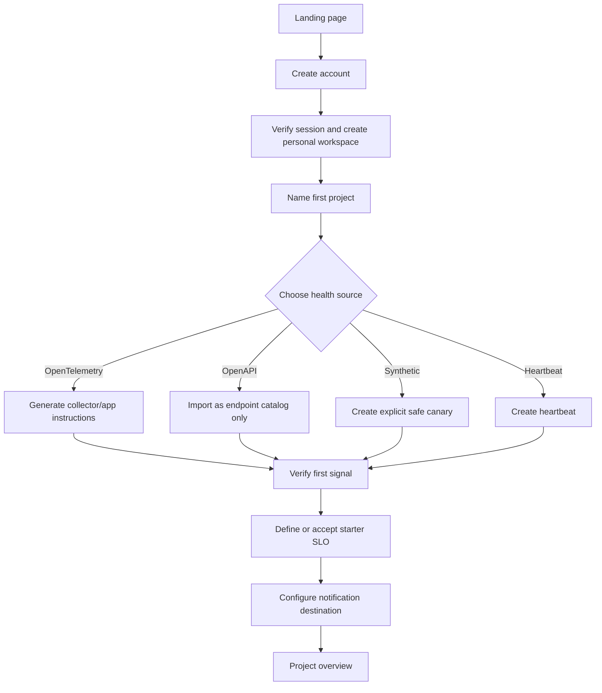
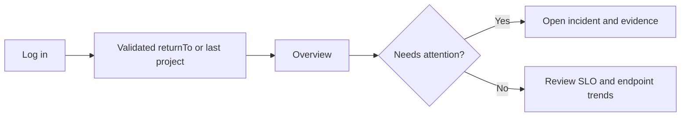
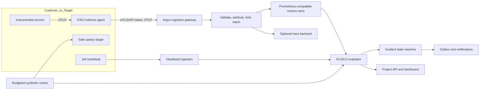

# Argus Transformation Blueprint

## Executive outcome

Argus should not treat authentication as a feature of the Projects tab and
should not treat every imported API operation as a synthetic health check.
Those two choices create the same underlying problem: the product does not yet
have one explicit control-plane boundary.

The recommended product is:

- public only for product explanation, registration, login, password recovery,
  and published status pages;
- authenticated for projects, endpoints, monitors, incidents, integrations,
  team access, API tokens, and status-page management;
- project-scoped for every private resource;
- telemetry-first for broad route health;
- synthetic only for explicit, safe, low-volume canaries;
- SLO-driven for incidents and notifications.

The plan deliberately retains the sound parts of the repository: project
membership authorization, Asynq task durability and uniqueness, the hardened
route dialer, OpenAPI parsing, incident/outbox concepts, the visual design
tokens, and the strong parts of the keyboard tab implementation.

## 1. Review method and limits

The review covered `frontend/`, HTTP routing and middleware, authentication,
project/route application services, MySQL migrations, OpenAPI import, Asynq
scheduling, route evaluation, and current configuration.

Methods:

- line-by-line static review at commit `b576998`;
- current primary-source research listed in [SOURCES.md](SOURCES.md);
- current library documentation through Context7;
- a real-browser static pass against `#/projects`.

The browser pass could validate rendered semantics and guest state, but not
API-dependent workflows because Docker is unavailable and MySQL/Redis were not
running. The static server consequently produced expected `404` responses for
API calls. No claim in this document treats registration, project creation, or
monitoring as end-to-end runtime verified.

## 2. Current-state diagnosis

### 2.1 Two control planes are exposed in one page

The top bar exposes an optional legacy API key and save action
(`frontend/index.html:30-48`). Overview immediately exposes Add monitor
(`frontend/index.html:88-123`), and other private creation tools are visible
before a user account is established. In contrast, account registration and
login exist only inside the final API Projects tab
(`frontend/index.html:288-321`).

The backend mirrors this split:

- legacy website, log, and feature routes use the global `X-API-Key`;
- project, route, and import routes use an opaque bearer token
  (`internal/platform/httpserver/fiber.go:30-56`);
- the API-key guard permits every request when `API_KEY` is empty
  (`internal/adapters/inbound/http/middleware.go:11-20`).

This makes “who am I?”, “what do I own?”, and “what can I do?” depend on the
selected tab rather than the session.

### 2.2 The current rendered guest state is internally contradictory

The browser accessibility snapshot exposed both the authentication gate and
the supposedly authenticated shell, including “Sign out.” It also exposed the
registration-only Display name field while in sign-in mode.

Root cause:

- markup and JavaScript use the `.hidden` class extensively;
- `frontend/styles.css` defines `.modal-overlay.hidden`, but no shared
  `.hidden { display: none !important; }` utility;
- `.field { display: ... }` overrides the browser's native `[hidden]` behavior.

This is a P0 defect because it makes state, focus order, and accessibility tree
unreliable. Add both `.hidden` and `[hidden]` contracts before building further
on the current shell.

### 2.3 Project creation starts with implementation settings

The New project modal begins with interval, timeout, retries, and failure
thresholds (`frontend/index.html:343-386`). These are expert tuning values, not
the user’s primary goal. A new user must first understand Argus’s polling
implementation and only later add a source or endpoint.

The right first question is: “How will this project report health?”

- Connect OpenTelemetry
- Import an API definition
- Add a safe synthetic canary
- Add a job heartbeat
- Explore with sample data

### 2.4 Route entry does not reveal the final target

The route form asks separately for method, path, and base URL
(`frontend/index.html:390-468`). Client code only trims strings
(`frontend/projects.js:1767-1782`). The service uppercases the method, adds a
leading slash, removes a trailing slash, and trims the base URL
(`internal/domain/route.go:95-120`,
`internal/application/routes.go:105-150`).

At execution time, the worker concatenates base and path
(`internal/worker/route_evaluator.go:434-449`). Users never see:

- canonical endpoint identity;
- actual fetch URL after parameter substitution;
- normalization changes;
- redirect and private-address policy;
- whether a method is safe to run;
- projected request volume.

### 2.5 Broad active monitoring scales with route count and can mutate data

The scheduler scans due routes every 15 seconds by default
(`internal/config/config.go:53-58`) and fans out one task per route
(`internal/worker/route_processor.go:59-112`). Each route can retry up to five
times (`internal/worker/route_evaluator.go:266-313`). The allowed methods
include `POST`, `PUT`, `PATCH`, `DELETE`, and `TRACE`
(`internal/domain/route.go:95-104`).

Approximate request attempts:

```text
attempts_per_day =
  enabled_routes × (86,400 / interval_seconds) × (1 + retries) × locations
```

Examples, excluding redirects, dashboard polling, DNS, and TLS:

| Routes | Interval | Retries | Locations | Attempts/day |
|---:|---:|---:|---:|---:|
| 100 | 300 s | 0 | 1 | 28,800 |
| 1,000 | 300 s | 0 | 1 | 288,000 |
| 1,000 | 300 s | 1 | 1 | 576,000 |
| 1,000 | 10 s | 0 | 1 | 8,640,000 |
| 1,000 | 10 s | 1 | 3 | 51,840,000 |

Worker concurrency can cap instantaneous throughput, but then a backlog makes
“current” status stale. Capacity limiting does not make the signal correct.

## 3. Target product architecture

### 3.1 Information architecture

```text
Public shell
├── Argus brand and concise value statement
├── Create account (primary)
├── Log in (secondary)
├── Documentation
└── Published status pages

Authenticated shell
├── Project switcher
├── Overview
├── Endpoints
├── SLOs
├── Incidents
├── Synthetic checks
├── Heartbeats
├── Integrations
├── Status pages
├── Team and access
└── Account menu
```

Rules:

- Register and Log in occupy the top-right header in guest state.
- After authentication they become project switcher, notifications, and account
  menu.
- Guest users do not see private create/edit/delete controls.
- A private deep link opens authentication and preserves a validated local
  `returnTo`.
- Published status pages use a distinct public route and data contract.
- Legacy API keys leave the top bar. Project automation tokens live under
  Settings, are scoped and expiring, are displayed once, and are stored hashed.

### 3.2 Authentication decision

Use one server-side opaque browser session:

- set as `HttpOnly; Secure; SameSite=Lax` or stricter;
- rotate after register/login and privilege changes;
- enforce CSRF protection for state-changing requests;
- implement idle and absolute expiry;
- offer “sign out this session” and “sign out all sessions”;
- return the complete current user and accessible-project context from
  `/api/auth/me`;
- keep project-scoped API tokens only for non-browser automation.

The existing opaque random token and hashed database storage are useful, but
placing the raw 30-day credential in `localStorage`
(`frontend/projects.js:108-127`) exposes it to any same-origin script. OWASP’s
current session guidance explicitly advises against this storage pattern.

All management APIs must use the same identity boundary. The legacy
`X-API-Key` route family should be migrated, versioned, and removed from the
browser. A production deployment must never silently become unauthenticated
because a variable is absent.

### 3.3 Authorization matrix

| Capability | Owner | Editor | Viewer | Guest |
|---|:---:|:---:|:---:|:---:|
| View project health and incidents | Yes | Yes | Yes | No |
| Create/edit endpoint definitions | Yes | Yes | No | No |
| Configure synthetic checks | Yes | Yes | No | No |
| Configure SLOs and integrations | Yes | Yes | No | No |
| Manage members and tokens | Yes | No | No | No |
| Delete/archive project | Yes | No | No | No |
| View published status page | Yes | Yes | Yes | Yes |
| Manage status page | Yes | Yes | No | No |

The existing centralized project authorization and indistinguishable
not-found/not-a-member response are good foundations
(`internal/application/projects.go:110-133`,
`internal/api/project_authz.go:28-60`).

## 4. User journeys, stories, and wireframes

### 4.1 New-user journey



Success criteria:

- median register-to-project under two minutes;
- no monitoring request occurs merely because a project or import was created;
- the source-connection step can be skipped and resumed;
- every step explains what data Argus will receive or send;
- progress survives reauthentication.

### 4.2 Returning-user journey



### 4.3 Add-project wireframe

```text
┌──────────────────────────────────────────────────────────────────────┐
│ ARGUS                             Docs     Log in   [Create account] │
└──────────────────────────────────────────────────────────────────────┘

Authenticated
┌──────────────────────────────────────────────────────────────────────┐
│ ARGUS   [Project: Payments ▾]             Help   Alerts   [User ▾]  │
├──────────────────────────────────────────────────────────────────────┤
│ Create a project                                             Step 1/4│
│                                                                      │
│ Project name *        [ Payments API                              ]  │
│ Environment           [ Production ▾ ]                               │
│ Description           [ Customer checkout and settlement          ] │
│                                                                      │
│                                             [Cancel] [Continue →]    │
└──────────────────────────────────────────────────────────────────────┘
```

Do not expose retry/interval thresholds in step one. Put advanced defaults in
project settings and expose them only when a synthetic source is selected.

### 4.4 Source-selection wireframe

```text
How should Argus observe this project?

┌ OpenTelemetry ─ Recommended ┐  Real traffic, low target overhead
└─────────────────────────────┘
┌ Import OpenAPI              ┐  Endpoint catalog; sends no requests
└─────────────────────────────┘
┌ Synthetic canary            ┐  External test for a critical safe path
└─────────────────────────────┘
┌ Heartbeat                   ┐  Jobs and scheduled processes
└─────────────────────────────┘

[Do this later]                                           [Continue →]
```

### 4.5 Add-endpoint / canary wireframe

```text
Create synthetic canary

Method  [GET ▾]   Base URL [https://api.example.com]
Route template    [/v1/orders/{orderId}]

Canonical identity
GET https://api.example.com/v1/orders/{orderId}

Fetch preview
https://api.example.com/v1/orders/example-order

Safety
✓ HTTPS public host
✓ Safe method
✓ Redirect credentials blocked across origins
! Estimated 288 requests/day at a 5-minute interval

[Advanced settings ▾]                        [Cancel] [Create disabled]
```

The default final action is “Create disabled.” Enabling requires an explicit
review of request volume, fixtures, credentials, and environment.

### 4.6 Representative user stories

**US-AUTH-01**

As a new user, I can register from the persistent header and arrive in a guided
first-project flow so I understand that the whole product belongs to my
account.

Acceptance criteria:

- Register is the guest primary action and Log in is secondary.
- Registration-only fields are absent from the sign-in accessibility tree.
- Successful authentication replaces auth actions throughout the shell.
- A failed request identifies the field, sets `aria-invalid`, focuses the first
  error, and preserves all safe input.

**US-PROJ-01**

As an authenticated user, I can create a project by describing its identity
before selecting a monitoring source.

Acceptance criteria:

- project name and environment are the only required first-step decisions;
- creation settings are explained in user language;
- project state is project-scoped and role-checked;
- cancel and browser Back do not create partial monitoring work.

**US-IMPORT-01**

As an editor, I can import OpenAPI as an endpoint catalog and see normalization
changes and conflicts without generating target traffic.

Acceptance criteria:

- preview shows created/updated/conflicting/collapsed operations;
- import commit generates zero outbound probes;
- methods, route templates, server variables, and canonical identities are
  visible;
- unsafe methods are never selected as canaries automatically.

**US-SYN-01**

As an editor, I can create a bounded canary and understand its cost and side
effects before it runs.

Acceptance criteria:

- GET/HEAD only by default;
- no retries for a non-idempotent method;
- projected requests/day and concurrency are shown;
- probe budgets are enforced server-side;
- saved credentials are references to encrypted secrets, not raw JSON blobs.

**US-SLO-01**

As an on-call user, I can see whether an alert represents real user pain,
missing telemetry, or a failed canary.

Acceptance criteria:

- real-traffic SLI and synthetic evidence are distinct;
- no-data is not silently converted to healthy or failing;
- page/ticket severity follows burn rate and window;
- the incident explains threshold, evidence, and next action.

## 5. UI, accessibility, and motion report

### 5.1 Strengths to preserve

- A distinctive “watchtower/control room” visual language with consistent
  semantic colors and typography.
- Central motion tokens under 300 ms for interactive transitions.
- Skip link and visible `:focus-visible` outline.
- Correct roving focus and arrow-key behavior for the main tabs
  (`frontend/app.js:96-125`).
- Tabular numbers for operational values.
- Good use of button press feedback and restrained modal scale.
- A focus trap exists for the legacy confirmation dialog
  (`frontend/app.js:473-492`), demonstrating a reusable pattern.

### 5.2 Prioritized usability and accessibility findings

| Priority | Finding | Evidence | Required outcome |
|---|---|---|---|
| P0 | Hidden state is broken | rendered snapshot; missing global `.hidden`; `[hidden]` overridden | one tested hidden contract; hidden content absent from DOM accessibility tree |
| P0 | Guest users see private creation UI | `frontend/index.html:88-160` | replace with guest landing/auth actions |
| P0 | Auth is scoped to one tab | `frontend/index.html:288-337` | global session-aware shell |
| P1 | Project modals have no focus trap or inert background | `frontend/projects.js:1600-1624` | native `<dialog>` or complete dialog controller |
| P1 | Sortable headers are clickable `<th>` elements | `frontend/projects.js:847-863` | a `<button>` in each sortable header with `aria-sort` |
| P1 | Auto-refresh has no pause/frequency control | `frontend/app.js:623-631`; project poll every 20 s | pause when hidden; user control; announce only material state |
| P1 | Whole dynamic views use `aria-live` | `frontend/index.html:333-336` | narrow live regions for results/errors only |
| P1 | Canvas charts have labels but no data alternative | `frontend/projects.js:749-753,1094-1098` | summary plus accessible table/download |
| P1 | URL inputs lack `type=url`, `name`, and useful autocomplete | route/monitor forms in `frontend/index.html` | semantic input contracts and inline validation |
| P1 | Errors are detached from fields | `frontend/projects.js:424-431` | `aria-describedby`, `aria-invalid`, focus first invalid field |
| P2 | Toast dismiss target is too small | `frontend/styles.css:1018-1028` | at least 24×24 CSS px, preferably 44×44 |
| P2 | Checkbox targets rely on browser intrinsic size | `frontend/styles.css:1316-1329` | label hit area at least 24×24 |
| P2 | Placeholder labels a top-bar credential | `frontend/index.html:35-41` | remove browser key entry; never rely on placeholder |
| P2 | `/` shortcut cannot be disabled/remapped | `frontend/app.js:127-136` | add shortcut setting or use modified key |

WCAG 2.2 AA is the target. Verification must include keyboard-only use, 200%
zoom, 320 CSS-pixel width, screen-reader smoke tests, light/dark contrast,
forced colors, and reduced motion.

### 5.3 Motion decision

Using the exact motion vocabulary:

| Before | After | Why |
|---|---|---|
| perpetual brand **Loop** | static brand state; optional one-time reveal | decoration should not compete with alerts |
| panel **Fade in** plus translation on every tab | instant tab switch | navigation is high-frequency and should feel immediate |
| continuous refresh **Pulse** | pulse/spinner only while a request is active | motion gains a cause and a finish |
| global 0.001 ms animation override | semantic reduced-motion rules | preserve color, opacity, focus, and loading feedback |
| hover styles on all pointers | hover only under `hover:hover` and `pointer:fine` | avoid sticky touch states |
| modal only animates entry | state-driven, interruptible entry/exit after dialog semantics | complete lifecycle without queued keyframes |

Standalone implementation plans are in
[`animation-plans/`](../../animation-plans/README.md).

## 6. Canonical URL and route contract

### 6.1 Goals

Normalization must:

- turn equivalent user input into one stable endpoint identity;
- preserve the information needed to make a correct request;
- show users exactly what changed;
- reject ambiguous or dangerous input early;
- remain separate from network authorization and SSRF protection.

Store at least three representations:

| Representation | Purpose | Example |
|---|---|---|
| `input_value` | audit and user correction | ` HTTPS://EXAMPLE.com:443/a/../v1/%70ets/ ` |
| `canonical_identity` | uniqueness/mapping | `https://example.com/v1/pets/` plus method/template policy |
| `fetch_url` | concrete canary execution | `https://example.com/v1/pets/example` |

Display values may preserve friendly Unicode; canonical host identity should use
an ASCII IDNA representation.

### 6.2 Input model

```text
Environment
  id, project_id, name
  scheme, canonical_host, port
  base_path

Endpoint
  id, project_id, environment_id
  method, route_template
  canonical_key_sha256
  source (manual | openapi | telemetry)

SyntheticCheck
  endpoint_id
  concrete_path/query fixture
  secret_reference_ids
  interval, timeout, retry_policy
  enabled, budget
```

Endpoint identity must include environment or canonical origin. The existing
database uniqueness key only uses `(project_id, method, path-prefix)`
(`db/migrations/0005_projects.up.sql:45-93`), so identical paths on production
and staging can collide and long-path prefix collisions remain possible.

Recommended uniqueness:

```text
canonical_key = SHA-256(
  project_id + "\n" +
  environment_id + "\n" +
  uppercase_method + "\n" +
  normalized_route_template
)
```

Use a full binary/hash unique index and keep a normal non-unique index for
human queries.

### 6.3 Normalization pipeline

1. **Bound and clean input**
   - enforce byte and code-point limits;
   - trim Unicode whitespace;
   - reject NUL, C0/C1 controls, bidi controls, CR/LF, backslash, and invalid
     UTF-8;
   - never invent a scheme in backend persistence.

2. **Parse structurally**
   - use Go `net/url`;
   - require an absolute `http` or `https` origin for an environment;
   - require hostname;
   - reject userinfo and fragments;
   - reject invalid/empty/out-of-range ports.

3. **Canonicalize origin**
   - lowercase scheme and host;
   - remove one terminal DNS dot;
   - convert international hostname to IDNA ASCII;
   - normalize IPv6 textual form and brackets;
   - remove `:80` for HTTP and `:443` for HTTPS;
   - preserve non-default ports.

4. **Canonicalize path/template**
   - ensure one leading slash;
   - remove dot segments according to RFC 3986;
   - reject encoded `/` or `\` by default because routing layers disagree;
   - uppercase percent-hex digits;
   - decode percent-encoded unreserved characters;
   - preserve case because URL paths are generally case-sensitive;
   - validate balanced `{parameter}` names;
   - never collapse duplicate slashes unless a project policy explicitly says
     the target router treats them as equivalent;
   - use one documented trailing-slash policy. Prefer preserving root and
     preserving non-root slash semantics, with an explicit UI merge option.

5. **Handle query separately**
   - endpoint identity normally excludes concrete query values;
   - represent parameter names/schema in endpoint metadata;
   - represent canary values in a fixture;
   - preserve repeated-key ordering unless target semantics are explicitly
     known;
   - never copy secrets into canonical identity or logs.

6. **Compose safely**
   - use parsed URL reference resolution;
   - never concatenate base and path as strings;
   - substitute template values with `url.PathEscape`;
   - validate the final URL again.

7. **Apply safety policy**
   - validation at create/update provides immediate feedback;
   - resolve and validate every IP at dial time;
   - validate every redirect;
   - block metadata, loopback, link-local, private, multicast, and reserved
     ranges unless a deliberately isolated customer-side agent policy applies;
   - strip credentials on cross-origin redirects;
   - enforce an egress firewall as a second boundary.

The current route evaluator already implements strong dial-time resolved-IP and
redirect revalidation (`internal/worker/route_evaluator.go:113-259`). Preserve
it. Normalization is not an authorization decision.

### 6.4 Preview API

```http
POST /api/projects/{projectId}/endpoint-normalization:preview
Content-Type: application/json

{
  "method": " get ",
  "baseUrl": "HTTPS://EXAMPLE.com:443/api/../",
  "routeTemplate": "v1/%70ets/{petId}"
}
```

```json
{
  "valid": true,
  "canonical": {
    "method": "GET",
    "origin": "https://example.com",
    "routeTemplate": "/v1/pets/{petId}",
    "identity": "GET https://example.com/v1/pets/{petId}"
  },
  "changes": [
    {"field": "method", "code": "case_normalized"},
    {"field": "baseUrl", "code": "default_port_removed"},
    {"field": "routeTemplate", "code": "unreserved_percent_decoded"}
  ],
  "safety": {
    "methodClass": "safe",
    "probeDefault": "disabled",
    "networkValidation": "repeated_at_execution"
  }
}
```

Validation responses use stable machine codes, field pointers, plain-language
messages, and safe suggestions. Bulk/OpenAPI preview reports row-level results
and collapsed duplicates before commit.

### 6.5 Backfill and rollout

1. Add nullable canonical/environment/hash columns.
2. Dual-write normalized values for new changes.
3. Backfill in bounded ID batches and record conflicts.
4. Classify conflicts as exact duplicate, environment collision, prefix-index
   collision, or semantic ambiguity.
5. Resolve conflicts through an operator report; never delete silently.
6. Add the unique hash constraint after conflict resolution.
7. Switch reads behind a feature flag.
8. Remove the legacy uniqueness rule only after rollback expiry.

Property/fuzz tests must cover idempotence:

```text
normalize(normalize(x)) == normalize(x)
```

and must prove that display, identity, and fetch representations cannot inject
authority, query, fragment, or extra path segments.

## 7. Monitoring alternatives and selected architecture

### 7.1 Options

| Option | Target load | Broad route evidence | No-traffic evidence | Risk/complexity | Decision |
|---|---:|---|---|---|---|
| Probe every route | Very high | weak/fixture-dependent | Yes | mutation, SSRF, secrets, backlog | Reject |
| Health/readiness endpoints only | Low | No | Yes | simple but shallow | Retain as canary |
| Prometheus pull | Very low | Strong RED metrics | No-data only | network discovery | Supported |
| OTLP push through Collector | Very low | Strong RED/traces | No-data only | ingestion/cardinality | Primary |
| Logs only | Low | variable | No-data only | parsing/privacy | Fallback |
| eBPF/service mesh | Low | good network evidence | No-data only | platform-specific | Future adapter |
| Synthetic canaries | Budgeted | only selected journeys | Yes | outbound security | Complement |
| Heartbeats | Near zero | jobs only | Yes | simple | Complement |
| RUM | zero server probes | browser experience | traffic-dependent | privacy/sampling | Optional |

### 7.2 Decision: telemetry-first hybrid monitoring



Routine route health comes from real requests through OpenTelemetry HTTP server
metrics:

- request count;
- error/status-class count;
- `http.server.request.duration` histogram;
- active requests where available;
- resource identity: service, environment, project/tenant mapping;
- route dimension: stable route template only.

Raw URI paths must never substitute for `http.route`; the OpenTelemetry HTTP
semantic conventions explicitly require a low-cardinality route template.

Synthetic monitoring remains for:

- public reachability from outside;
- `/live` and `/ready`;
- a small number of critical read-only journeys;
- low-traffic services where real-traffic SLO math is unstable;
- uninstrumented external dependencies under a strict budget.

Heartbeats remain the correct model for cron jobs, workers, and scheduled
pipelines. Queue, database, collector, and ingestion health use white-box
metrics, not HTTP probes per application route.

### 7.3 Probe safety policy

- Created disabled; enabling is a separate authorized action.
- GET/HEAD only by default.
- TRACE prohibited.
- A state-changing method requires an explicit “unsafe synthetic” capability,
  isolated test environment, idempotency key strategy, teardown plan, and zero
  automatic retries unless application semantics prove safety.
- Per-project requests/minute, concurrent probes, response-byte, redirect,
  timeout, and daily-attempt budgets are server-enforced.
- Add deterministic jitter to avoid synchronized bursts.
- Back off on rate limiting and target distress.
- Secrets are encrypted references with audit history and rotation; they are
  never returned in API responses.
- Prefer a customer-side agent for private targets. Do not relax the central
  control-plane SSRF boundary to reach arbitrary private networks.

### 7.4 Collector and ingestion policy

- Accept OTLP/gRPC and OTLP/HTTP at a dedicated ingestion origin/port.
- Authenticate each sender and map it to one project/environment before any
  storage write.
- Reject caller-supplied tenant/project attributes that conflict with the
  credential mapping.
- Enforce payload, point, series, attribute, and cardinality budgets.
- Allowlist or transform attributes; redact secrets and personal data.
- Put memory limiter before batch processing.
- Use exporter sending queues with retry/backoff; enable persistent WAL where
  restart loss is unacceptable.
- Monitor queue size/capacity, rejected points, failed exports, ingest lag,
  per-tenant volume, and last-seen timestamps.
- Begin without Kafka. Add an external message queue only when measured
  durability/decoupling needs justify its operational cost.

### 7.5 SLI, SLO, and alerts

Starter availability SLI:

```text
good requests / eligible requests
```

Starter latency SLI:

```text
eligible requests below objective / eligible requests
```

Define eligible traffic, status classification, maintenance, client-cancel,
and no-data policies explicitly. Synthetic and real-traffic SLIs are separate
indicators even when shown in one service view.

Use multi-window, multi-burn-rate alerts. A practical 99.9% starting point from
the Google SRE Workbook is:

| Severity | Long window | Short window | Burn rate | Budget consumed |
|---|---:|---:|---:|---:|
| Page | 1 h | 5 min | 14.4× | 2% |
| Page | 6 h | 30 min | 6× | 5% |
| Ticket | 3 d | 6 h | 1× | 10% |

Do not apply this mechanically to low-traffic services. Require a minimum event
count, aggregate related services, or complement with canaries/heartbeats.
Alerts should represent user pain or imminent budget exhaustion, not every
transient technical symptom.

### 7.6 Self-monitoring

Monitoring is incomplete without monitoring its own evidence pipeline:

- collector/gateway availability;
- ingest rejection and throttling;
- queue depth, age, retry, and dead-letter volume;
- time-series write/read latency;
- SLO evaluation duration and staleness;
- last telemetry per service/environment;
- synthetic schedule lag and probe budget usage;
- outbox delivery lag and failure;
- clock skew.

The UI must distinguish `healthy`, `failing`, `unknown/no data`, `stale`, and
`disabled`. Missing telemetry is never “healthy.”

## 8. Repository implementation map

### 8.1 Frontend

| Area | Current files | Required change |
|---|---|---|
| App shell/auth | `frontend/index.html`, `app.js`, `projects.js` | one session store/client; guest and authenticated shells; header auth/account states |
| Hidden state | `frontend/styles.css` | tested `.hidden` and `[hidden]` contract |
| Navigation | same | replace legacy/project split; project switcher; URL-backed app routes |
| Project creation | `index.html`, `projects.js` | four-step identity/source/verify/SLO flow |
| Endpoint forms | same | normalization preview, safety/cost summary, disabled-by-default canary |
| Tables/charts | `projects.js` | semantic sort buttons, accessible data alternatives |
| Dialogs | `projects.js`, styles | native dialog or focus trap, inert background, scroll containment |
| Live data | both JS files | one refresh policy; pause/control frequency; consider SSE for incident state |
| Security | both JS files | remove credential storage and inline event handlers; strict CSP-compatible DOM |
| Motion | styles and JS | execute plans under `plans/` |

Avoid a framework migration inside the first delivery slice. The current
vanilla frontend can support the target flow. Reconsider a component framework
only when state/route complexity becomes a measured maintenance problem.

### 8.2 Backend and API

| Area | Required change |
|---|---|
| HTTP middleware | unified session authentication, CSRF, rate limits, production secure-default checks, request IDs, server timeouts |
| Auth service | cookie session lifecycle, rotation, revoke-all, current-user context, audit events, bounded password policy |
| Resource scope | migrate legacy monitors/channels/windows/status management under projects and membership |
| Normalization | new domain service and preview endpoint; reuse in manual, bulk, legacy, and OpenAPI paths |
| Environments | explicit project environment/origin model |
| Endpoint catalog | canonical identity separated from synthetic configuration |
| Telemetry ingest | dedicated OTLP gateway/adapter, credential attribution, quotas, sanitization |
| SLO engine | objective/budget models, rollups, multi-window evaluation, no-data state |
| Synthetic policy | dedicated safe-check model, budgets, jitter, agent/location, encrypted secret refs |
| Heartbeats | project-scoped token and incident rules |
| Events | retain transactional outbox; make incident events source-aware and idempotent |
| APIs | version and deprecate legacy endpoints; publish OpenAPI for new control plane |

### 8.3 Data model

Add migrations for:

- browser sessions and scoped automation/ingest tokens;
- environments;
- canonical endpoints and endpoint-source mappings;
- encrypted secret references;
- synthetic checks, locations, budgets, and execution results;
- telemetry service/route mappings and last-seen state;
- SLOs, SLI windows, error budgets, and evaluations;
- source-aware incidents/evidence;
- audit events.

Do not store high-volume raw telemetry in the current `route_checks` table.
Use a Prometheus-compatible store for metrics and keep MySQL for control-plane
configuration, mappings, incidents, audit, and compact summaries.

### 8.4 Worker and operations

Retain Asynq for control-plane jobs, synthetic tasks, backfills, aggregation,
and notification outbox work. Its current periodic scheduling, uniqueness
locks, bounded retries, queue weights, and graceful shutdown are appropriate.

Change:

- separate `critical`, `ingest-control`, `synthetic`, `aggregation`,
  `notifications`, and `maintenance` queues;
- prefer weighted queues over strict priority unless starvation is intended;
- record queue latency, attempt, terminal reason, and dead-letter state;
- make all tasks idempotent;
- stop scanning and enqueueing every endpoint after migration;
- keep a compatibility queue only during the rollback window.

## 9. Migration strategy memorandum

### Objective

Reduce target-generated monitoring load by at least 90% for migrated projects
while improving route-level evidence and maintaining an immediate rollback.

### Principles

- no big-bang replacement;
- no imported route becomes active automatically;
- telemetry can shadow but not change incidents initially;
- compare signal quality before switching authority;
- preserve existing history as legacy evidence;
- retire behavior only after a measured rollback window.

### Phases

**Phase 0 — Safety and measurement**

- instrument Argus itself;
- measure current attempts, redirects, retries, scheduler lag, queue age, and
  target responses by project;
- disable new mutating probes by default;
- add load and safety budgets;
- fix global authentication/hidden-state P0 defects.

**Phase 1 — Canonical model**

- add environments and canonical endpoint identities;
- preview/dual-write/backfill;
- import as catalog only;
- expose collision reports.

**Phase 2 — Telemetry foundation**

- deploy Collector gateway and metrics backend;
- add scoped ingest credentials and attribution;
- instrument Argus with current Fiber v2 OpenTelemetry middleware and Go SDK;
- map low-cardinality route templates;
- show telemetry in a non-authoritative shadow panel.

**Phase 3 — SLO and incident shadow**

- define starter SLIs/SLOs;
- run evaluations without paging;
- compare old incidents with burn-rate candidates;
- tune missing-data and low-traffic rules.

**Phase 4 — Pilot**

- select low-risk projects with owners and rollback contacts;
- enable telemetry-authoritative incidents;
- retain a few canaries;
- observe at least one full SLO window and incident drill.

**Phase 5 — Default and retirement**

- telemetry-first becomes default for new projects;
- migrate remaining projects by cohort;
- freeze broad route polling;
- retain rollback for a defined period;
- delete scheduler/database compatibility paths only after approval.

### Decision gates

| Gate | Evidence required |
|---|---|
| G1 Safety | zero automatic mutating probes; auth/rate-limit/SSRF tests pass |
| G2 Identity | normalization idempotence and collision backfill resolved |
| G3 Ingestion | tenant attribution, quotas, WAL/retry, and self-monitoring pass |
| G4 Signal | shadow SLI agrees with known incidents and handles no-data |
| G5 Pilot | ≥90% target-request reduction, acceptable alert precision/recall |
| G6 Retirement | rollback drill passed; legacy dependency inventory empty |

## 10. Scrum delivery plan

The Product Goal:

> Users can understand endpoint health from real telemetry without Argus
> generating traffic proportional to route count, while a small set of safe,
> budgeted canaries verifies external reachability.

The eight two-week Sprints below are a forecast, not a promise. The Product
Owner orders the backlog; each Sprint must produce a usable Increment.

### Definition of Done

Every item includes:

- reviewed implementation and relevant unit/integration/E2E tests;
- negative authorization and tenant-attribution tests;
- migration and rollback or an explicit N/A;
- metrics, logs, dashboard, and runbook for the feature;
- secret/privacy/redaction review;
- WCAG 2.2 AA keyboard/focus/name-role-value/reduced-motion verification for UI;
- performance/cardinality/load budget;
- updated API/user/operator documentation;
- feature flag where rollout risk exists;
- no unresolved Critical/High finding without documented risk acceptance;
- staging demonstration.

### Epic backlog

| Epic | Outcome | Key dependencies |
|---|---|---|
| E1 Identity and control plane | one global session and project boundary | none |
| E2 Canonical endpoint model | stable environment-aware identity | E1 |
| E3 Synthetic safety | explicit, bounded canaries | E1, E2 |
| E4 Telemetry ingestion | authenticated OTLP to metrics store | E1 |
| E5 SLI/SLO incidents | explainable burn-rate alerts | E2, E4 |
| E6 Product onboarding | register-to-first-signal journey | E1–E5 |
| E7 Migration and operations | shadow, pilot, cutover, retirement | all |
| E8 Accessibility and quality | WCAG/load/security across Increments | cross-cutting |

### Ordered backlog

| ID | Story/outcome | Acceptance summary | Estimate |
|---|---|---|---:|
| P0-01 | Fix hidden-state contract | guest tree contains no authenticated shell or registration-only fields | 3 |
| P0-02 | Stop automatic unsafe probes | imports/new routes create zero traffic; unsafe methods disabled | 5 |
| ID-01 | Unified browser session | secure cookie, CSRF, rotation, expiry, revoke-all | 8 |
| ID-02 | Protect all management routes | no API-key fail-open; project roles cover migrated resources | 8 |
| ID-03 | Auth abuse controls | per-IP/account limiter, audit, generic login errors, body limits | 5 |
| CAN-01 | Normalization library | idempotent RFC-aware origin/template rules and stable error codes | 8 |
| CAN-02 | Preview API and UI | shows canonical identity, fetch preview, changes, safety | 8 |
| CAN-03 | Environment/hash migration | dual-write, batched backfill, conflict report, rollback | 8 |
| SYN-01 | Synthetic policy model | safe methods, disabled default, server budgets and jitter | 8 |
| SYN-02 | Secret references | encrypted store adapter, rotate/revoke, never echo | 8 |
| OTEL-01 | Ingestion credentials | project/environment attribution and tenant isolation | 8 |
| OTEL-02 | Collector gateway | OTLP, limits, batch, queue/WAL, health and runbook | 13 |
| OTEL-03 | Metrics backend | retention, recording rules, backup/capacity plan | 8 |
| MAP-01 | Endpoint mapping | service/environment/route template to canonical endpoint | 8 |
| SLO-01 | SLO control plane | objectives, eligible events, no-data and maintenance policy | 8 |
| SLO-02 | Burn-rate evaluator | multi-window rules, low-traffic safeguards, idempotent incidents | 13 |
| UX-01 | Global app shell | guest header auth; authenticated project/account controls | 8 |
| UX-02 | First-project wizard | identity, source, verification, starter SLO | 13 |
| UX-03 | Accessible evidence views | semantic tables, chart alternatives, focused errors, dialogs | 8 |
| MIG-01 | Baseline and shadow | current-load dashboard and non-authoritative v2 comparison | 8 |
| MIG-02 | Pilot cohort | owners, success metrics, incident drill, rollback | 8 |
| MIG-03 | Cohort migration/retirement | ≥90% request reduction and legacy dependency zero | 13 |

### Sprint forecast

| Sprint | Sprint Goal | Candidate Increment |
|---|---|---|
| 1 | Make the existing control plane safe and measurable | P0 fixes, request baseline, auth abuse controls |
| 2 | Establish one identity and endpoint language | unified session, protected management APIs, normalization core |
| 3 | Make endpoint creation deterministic and safe | environments, preview UI/API, catalog-only import, canary policy |
| 4 | Receive tenant-safe telemetry | ingest credentials, Collector gateway skeleton, self-metrics |
| 5 | Store/map useful RED evidence | metrics backend, recording rules, endpoint mapping |
| 6 | Turn evidence into explainable SLO state | SLO model, burn-rate shadow incidents, no-data policy |
| 7 | Deliver the new onboarding and operational UI | authenticated shell, first-project wizard, accessible evidence |
| 8 | Prove migration and retire broad polling | pilot outcomes, rollback drill, cohort/cutover decision |

### Sprint Review metrics

- register-to-first-project and first-signal completion;
- task success/error/drop-off by wizard step;
- active probe attempts/project/day and reduction versus baseline;
- target 429/5xx attributable to Argus;
- telemetry ingest lag, rejection, queue saturation, and cardinality;
- endpoint mapping coverage;
- alert precision, recall, page volume, and time-to-detect;
- accessibility defects by severity;
- security/tenant isolation defects;
- rollback recovery time.

## 11. Acceptance test matrix

| Layer | Required tests |
|---|---|
| Auth | register/login/logout/all-sessions, expiry, CSRF, brute force, generic errors, returnTo validation |
| Authorization | owner/editor/viewer/guest matrix on every private endpoint |
| UI state | guest/authenticated tree separation, 320 px, 200% zoom, keyboard, screen reader, reduced motion |
| Normalization | table tests, fuzz, idempotence, IDNA, IPv6, percent encoding, dot segments, slash policy, collision |
| SSRF | literal/encoded IPs, DNS rebinding, redirect chains, metadata, private ranges, cross-origin secret stripping |
| Import | size/ref/operation limits, duplicate preview, zero outbound requests |
| Synthetic | method policy, idempotency, budgets, jitter, retry, rate limit, secret redaction, cancellation |
| Ingestion | auth, tenant spoofing, quotas, malformed OTLP, cardinality, restart/WAL, backpressure |
| SLO | window boundaries, late data, no-data, low volume, maintenance, clock skew, idempotent incident transition |
| Migration | dual read/write, conflict report, shadow comparison, feature flag, rollback drill |
| Performance | load at expected and 2× volume; queue age and dashboard query bounds |

## 12. Final recommendation

Approve the hybrid architecture and begin only with Sprint 1 safety and
measurement. Do not start by adding a telemetry backend while the product still
has two authentication systems, unsafe default probes, and ambiguous endpoint
identity. The order matters:

1. secure and measure the current behavior;
2. unify identity;
3. define canonical endpoints;
4. bound synthetic behavior;
5. ingest and attribute telemetry;
6. derive SLO evidence;
7. expose it through the new onboarding flow;
8. migrate by measured cohorts.

That path reaches a more advanced monitoring system without discarding the
repository’s useful worker, authorization, import, incident, and design-system
foundations.
