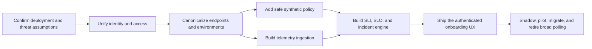

# Argus Product and Monitoring Transformation

Review date: 2026-07-28

Repository baseline: `b576998`

Working branch: `docs/argus-monitoring-ux-plan-20260728`

Language: English

Change mode: analysis and implementation planning; no product source code changed

## Decision

Argus should become one authenticated, project-scoped product and replace broad
route-by-route probing with hybrid monitoring:

1. OpenTelemetry metrics are the default evidence for routine endpoint health.
2. Synthetic requests are limited to explicit, safe, budgeted canaries.
3. Heartbeats monitor jobs and scheduled processes.
4. Published status pages remain public; every management capability requires a
   user session.

## Documents

- [Transformation blueprint](ARGUS_TRANSFORMATION_BLUEPRINT.md) — product
  design report, user flows, wireframes, URL contract, Monitoring v2 system
  design, migration strategy, Scrum backlog, release gates, and repository
  change map.
- [Security best-practices review](SECURITY_REVIEW.md) — evidence-based Go and
  JavaScript findings with severity, impact, remediation, and false-positive
  notes.
- [Skills and plugins decision](TOOLING_DECISION.md) — active capability
  inventory, marketplace rationale, optional connector recommendations, and
  confirmed installation status.
- [Research and standards register](SOURCES.md) — primary and current sources
  used for the decisions.
- [Completion and evidence matrix](COMPLETION_MATRIX.md) — requirement-by-
  requirement proof and verification boundaries.
- [Threat model](../../Argus-threat-model.md) — repository-grounded trust
  boundaries, assets, abuse paths, mitigations, and conservative deployment
  assumptions.
- [Motion implementation plans](../../animation-plans/README.md) — standalone
  plans produced by the read-only animation audit.

## Implementation order

## Non-negotiable release rules

- Importing an OpenAPI document creates zero active requests.
- `POST`, `PUT`, `PATCH`, `DELETE`, and `TRACE` are never probed by default.
- Browser session credentials are not stored in `localStorage`.
- A raw URL or path is never used as an unbounded telemetry label.
- URL normalization never replaces dial-time and redirect-time SSRF controls.
- Monitoring v2 cannot become authoritative until load reduction, attribution,
  alert accuracy, missing-data behavior, and rollback are demonstrated.
