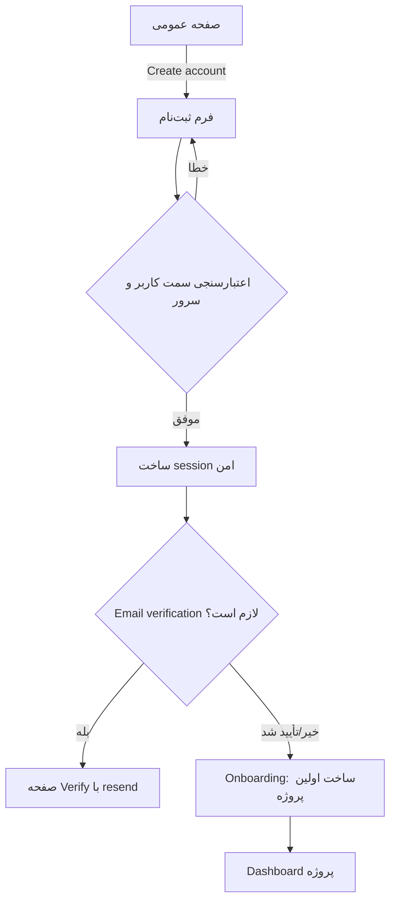
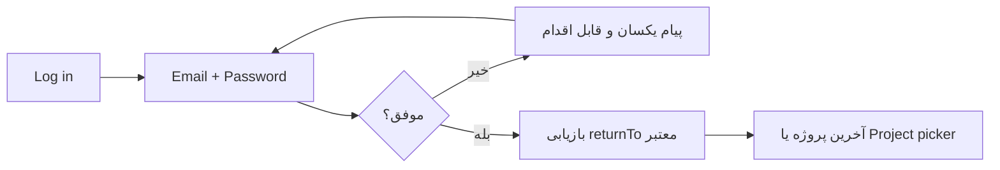
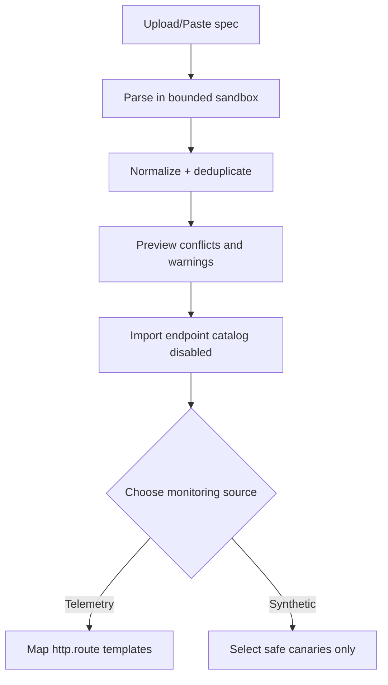

# ممیزی کامل محصول، UI/UX و فلوهای Argus

تاریخ: ۲۰۲۶-۰۷-۲۸
دامنه: `frontend/`، APIهای احراز هویت و Projects، فلوهای ساخت پروژه/route/import، دسترس‌پذیری و motion
روش: بررسی ایستا و خط‌به‌خط روی commit `b576998` با معیار WCAG 2.2 AA، راهنمای رابط وب، اصول طراحی Apple/Emil Kowalski و تحلیل task flow

> این سند «طراحی هدف» است. در این شاخه سورس UI تغییر نکرده تا تصمیم محصول، امنیت و معماری پیش از اجرا قابل بازبینی باشد.

## خلاصه‌ی مدیریتی

مسئله‌ی اصلی Argus یک فرم بدجای‌گذاری‌شده نیست؛ محصول در حال حاضر دو تجربه‌ی مستقل را در یک صفحه کنار هم گذاشته است:

- مانیتورینگ legacy با `X-API-Key` در نوار بالایی؛
- Projects با account و bearer token، اما auth فقط داخل تب Projects.

نتیجه این است که کاربر نمی‌داند «وارد سیستم شده» یا فقط یک API key محلی ذخیره کرده، ابزارهای خصوصی در حالت مهمان دیده و حتی refresh می‌شوند، و مدل مالکیت منابع برای همه‌ی قابلیت‌ها یکسان نیست. تغییر صحیح باید auth را به shell سراسری منتقل کند، همه‌ی قابلیت‌های خصوصی را project-scoped کند و creation flow را حول «هدف مانیتورینگ» بازطراحی کند.

### نتیجه‌های بحرانی

| اولویت | یافته | شواهد | پیامد |
|---|---|---|---|
| P0 | auth داخل Projects محبوس و از ابزارهای legacy جداست | `frontend/index.html:289-320`، `internal/platform/httpserver/fiber.go:31-56` | مدل ذهنی مبهم، دو سطح دسترسی، tenant boundary ناقص |
| P0 | token پروژه و API key در `localStorage` هستند | `frontend/projects.js:109-127`، `frontend/app.js:155-158,615-636` | هر XSS می‌تواند credential را استخراج کند |
| P0 | route جدید و importشده به‌صورت پیش‌فرض فعال است | `internal/application/routes.go:114-145`، `internal/application/imports.go:181-192` | درخواست ناخواسته، به‌خصوص برای methodهای تغییردهنده |
| P1 | ساخت پروژه پیش از تعریف environment/source انجام می‌شود | `frontend/index.html:343-385` | کاربر پروژه‌ای می‌سازد که هنوز قابل پایش تعریف‌شده ندارد |
| P1 | pollingهای legacy و Projects هم‌پوشان‌اند | `frontend/app.js:418-429,624-638`، `frontend/projects.js:14,384-391,648-653,958-963` | درخواست اضافی به خود Argus، تجربه‌ی ناپایدار و اعلان‌های زائد |
| P1 | URL/Route preview و normalization قابل مشاهده نیست | `frontend/index.html:393-462`، `internal/domain/route.go:95-120` | خطا دیر کشف می‌شود؛ کاربر نمی‌داند چه مقصدی واقعاً probe خواهد شد |

## ۱. مدل ذهنی و معماری اطلاعات هدف

### وضعیت فعلی

```text
Header
├── API key (legacy)
├── Theme
└── Refresh

Tabs
├── Overview (قابل مشاهده بدون account)
├── Monitors (قابل مشاهده بدون account)
├── Projects
│   └── Login/Register gate
└── ...
```

این ساختار «credential» را به‌جای «هویت» در مرکز قرار می‌دهد و login را ویژگی یک تب جلوه می‌دهد.

### ساختار هدف

```text
Public shell
├── Brand
├── Product explanation / public status discovery
└── Register (primary) · Log in (secondary)

Authenticated app shell
├── Project switcher
├── Overview
├── Endpoints
├── SLOs
├── Incidents
├── Integrations
├── Status pages
├── Team & access
└── Account menu
```

قواعد:

- بالاترین سمت قابل مشاهده‌ی header در حالت مهمان: `Create account` به‌عنوان primary و `Log in` به‌عنوان secondary.
- پس از ورود، CTAهای auth جای خود را به project switcher و account menu می‌دهند.
- کاربر مهمان CTA افزودن project/route/monitor را نمی‌بیند. اگر از deep link برسد، صفحه‌ی auth با `returnTo` امن نمایش داده می‌شود.
- status pageهای publishشده public هستند؛ مدیریت آن‌ها خصوصی است.
- فیلد API key از UI عمومی حذف می‌شود. API tokenهای automation در `Account/Project settings → API tokens` با scope و expiry مدیریت می‌شوند.

## ۲. فلوهای احراز هویت

### ۲.۱ ثبت‌نام؛ مسیر اصلی کاربر جدید



فیلدها:

- نام نمایشی؛ optional و قابل تکمیل بعدی.
- email با `type=email`, `name=email`, `autocomplete=email`, `inputmode=email`.
- password با `name=password`, `autocomplete=new-password`، امکان show/hide و متن الزامات قبل از خطا.
- checkbox پذیرش قوانین فقط اگر الزام حقوقی واقعی وجود دارد؛ بدون dark pattern.

رفتار:

- خطای duplicate email نباید امکان account enumeration نامحدود بسازد؛ پاسخ UI می‌تواند مسیر بازیابی حساب را بدون افشای قطعی پیشنهاد دهد.
- submit تنها هنگام request غیرفعال شود؛ مقدارها حفظ شوند؛ focus روی summary خطا و سپس اولین فیلد نامعتبر برود.
- بعد از موفقیت، session مرورگر در cookie با `HttpOnly`, `Secure` در production و `SameSite=Lax` یا سخت‌گیرانه‌تر باشد.

### ۲.۲ ورود؛ مسیر کاربر موجود



نیازهای کامل که امروز در محصول دیده نمی‌شوند:

- forgot password؛
- email verification/resend؛
- rate limit و progressive backoff؛
- revoke other sessions؛
- session expiry قابل فهم؛
- ثبت audit event برای login/logout/token lifecycle؛
- generic authentication errors.

### ۲.۳ خروج و انقضای session

- logout از هر صفحه در account menu قابل دسترسی باشد.
- انقضای session draft فرم را در `sessionStorage` فقط به‌عنوان داده‌ی غیرحساس حفظ کند، modal ورود را نشان دهد و پس از ورود ادامه دهد.
- پاسخ `401` باعث redirect loop یا پاک‌شدن بی‌توضیح داده‌ی کاربر نشود.
- `returnTo` فقط path نسبی same-origin و allowlisted را بپذیرد.

## ۳. فلو هدف «افزودن پروژه»

اصل طراحی: project باید سریع ساخته شود، اما مانیتورینگ پرریسک نباید پنهانی فعال شود.

### مرحله ۰: gate

- مهمان: CTA `Create account to add a project`.
- کاربر واردشده: CTA `New project`.
- کاربر بدون permission: CTA غیرفعال نیست؛ پیام روشن `You need Owner or Editor access` و لینک درخواست دسترسی.

### Wizard پیشنهادی

#### Step 1 — Basics

- Project name (required)
- Description (optional)
- Owner/team (اگر مدل team فعال است)

هدف: کمتر از ۳۰ ثانیه. تنظیمات retry/threshold در این مرحله حذف می‌شوند.

#### Step 2 — Environment

- Environment name: Production / Staging / Custom
- Base URL
- کارت preview:

```text
Entered     HTTPS://Api.Example.COM:443/v1/
Normalized  https://api.example.com/v1
Changes     scheme+host lowercased · default port removed · trailing slash normalized
DNS target  resolved only at check time; private addresses blocked by policy
```

- دکمه `Validate without saving`
- warning غیرمسدودکننده برای تغییر canonical؛ error مسدودکننده برای fragment، userinfo، scheme غیر HTTP(S)، control character یا مقصد سیاستاً ممنوع.

#### Step 3 — Monitoring source

انتخاب پیش‌فرض:

1. `OpenTelemetry (Recommended)` — پوشش همه‌ی endpointها بدون ساخت traffic مصنوعی.
2. `Synthetic canary` — فقط GET/HEAD امن و endpointهای محدود؛ بودجه‌ی probe نشان داده شود.
3. `Import OpenAPI` — فقط catalog import؛ هیچ probe خودکار.
4. `Heartbeat` — برای jobها.

برای Synthetic:

- برچسب واضح `Creates real requests`.
- نمایش محاسبه‌ی بار: `3 canaries × every 60s × 2 locations = 6 requests/min`.
- POST/PATCH/DELETE خاموش و در UI عادی غیرقابل انتخاب باشند؛ فعال‌سازی تنها در محیط sandbox با acknowledgment، fixture، idempotency strategy و cleanup.

#### Step 4 — Review

- خلاصه project/environment/source.
- `Create project`؛ نه `Start monitoring`.
- اگر source تله‌متری است: setup snippet و وضعیت `Waiting for telemetry`.
- اگر synthetic انتخاب شده: جداگانه `Enable 3 canaries` با confirmation.

### فلو import



پیش‌فرض `Enabled: true` فعلی باید به `synthetic_enabled: false` تبدیل شود. import یک عملیات catalog است، نه اجازه‌ی اجرای request.

## ۴. Wireframeهای متنی

### ۴.۱ صفحه عمومی — Desktop

```text
┌──────────────────────────────────────────────────────────────────────────┐
│ ARGUS                      Docs      Public status     Log in  [Sign up] │
├──────────────────────────────────────────────────────────────────────────┤
│ Know when your APIs fail—without hammering every route.                 │
│ Passive telemetry + deliberate canaries + SLO-based alerts.             │
│ [Create free account]  [View a public status page]                      │
│                                                                          │
│  Telemetry coverage       Synthetic canaries       Job heartbeats        │
└──────────────────────────────────────────────────────────────────────────┘
```

### ۴.۲ App shell — Desktop

```text
┌──────────────────────────────────────────────────────────────────────────┐
│ ARGUS  [Payments / Production ▾]          Search   Help   [Mersad ▾]    │
├──────────────┬───────────────────────────────────────────────────────────┤
│ Overview     │ Payments API                              [New endpoint]  │
│ Endpoints    │ 99.95% availability · 43 routes · telemetry connected     │
│ SLOs         │ ┌──────────┐ ┌──────────┐ ┌──────────┐                  │
│ Incidents 2  │ │ Error %  │ │ p95      │ │ Burn rate│                  │
│ Integrations │ └──────────┘ └──────────┘ └──────────┘                  │
│ Status pages │ Recent incidents / endpoint health                       │
│ Team         │                                                           │
└──────────────┴───────────────────────────────────────────────────────────┘
```

### ۴.۳ New project wizard

```text
┌──────────────────────────── New project ─────────────────────────────────┐
│ 1 Basics ━━━━━ 2 Environment ───── 3 Source ───── 4 Review             │
│                                                                          │
│ Project name *  [Payments API                                         ] │
│ Description     [Checkout and settlement services                     ] │
│                                                                          │
│                                           [Cancel] [Continue: Environment]│
└──────────────────────────────────────────────────────────────────────────┘
```

### ۴.۴ Mobile

```text
┌──────────────────────────┐
│ ARGUS          [Account] │
│ [Payments / Prod ▾]      │
├──────────────────────────┤
│ Overview                 │
│ 99.95% availability      │
│ ┌──────────────────────┐ │
│ │ Error budget 72%     │ │
│ └──────────────────────┘ │
│ Endpoints                │
│ GET /orders/{id}    UP   │
│ ...                      │
├──────────────────────────┤
│ Overview Endpoints More  │
└──────────────────────────┘
```

در mobile، wizard یک صفحه‌ی مستقل است، نه modal بلند؛ action اصلی sticky اما مزاحم keyboard نرم‌افزاری نیست.

## ۵. User storyها و معیار پذیرش UX

### US-UX-01 — ثبت‌نام سراسری

به‌عنوان بازدیدکننده می‌خواهم ثبت‌نام را در header ببینم تا بدانم قبل از افزودن مانیتور باید هویت بسازم.

Acceptance:

- CTA ثبت‌نام در viewportهای 320px تا desktop بدون منوی پنهان قابل یافتن است.
- login گزینه‌ی ثانویه است.
- هیچ create control خصوصی پیش از auth قابل اجرا نیست.
- deep link پس از auth به مقصد مجاز برمی‌گردد.

### US-UX-02 — دسترسی کامل پس از ورود

به‌عنوان کاربر واردشده می‌خواهم همه‌ی قابلیت‌های مجاز را بدون واردکردن API key دوم ببینم.

Acceptance:

- یک session مرورگر برای تمام APIهای خصوصی.
- navigation بر اساس permission است، نه وجود token محلی.
- `/auth/me` پروفایل و capabilityهای لازم را از سرور بازمی‌گرداند.
- منابع legacy پیش از نمایش، user/project ownership دارند.

### US-UX-03 — ساخت پروژه با هزینه‌ی قابل فهم

به‌عنوان owner می‌خواهم پیش از فعال‌سازی بدانم سیستم چه trafficی تولید می‌کند.

Acceptance:

- source انتخابی، تعداد canary، location و requests/min در review دیده می‌شود.
- import به‌تنهایی صفر request فعال می‌سازد.
- unsafe method به‌طور پیش‌فرض قابل probe نیست.

### US-UX-04 — URL قابل پیش‌بینی

به‌عنوان کاربر می‌خواهم نسخه‌ی normalized و تغییرات URL را قبل از ذخیره ببینم.

Acceptance:

- raw و normalized هم‌زمان قابل مشاهده‌اند.
- warning و error معنای متفاوت و icon+text دارند.
- نتیجه‌ی preview دقیقاً همان تابع backend است که save استفاده می‌کند.

### US-UX-05 — no-data درست

به‌عنوان کاربر telemetry-based می‌خواهم نبود traffic با downtime اشتباه نشود.

Acceptance:

- stateها حداقل `healthy`, `degraded`, `down`, `no_data`, `paused`, `unknown` هستند.
- `no_data` علت و آخرین زمان دریافت telemetry را نشان می‌دهد.
- synthetic canary تنها راه پیشنهادی برای اثبات availability در نبود traffic است.

## ۶. ممیزی دسترس‌پذیری WCAG 2.2

### یافته‌های اصلی

| شدت | معیار | یافته و شواهد | اصلاح |
|---|---|---|---|
| High | 2.1.1 Keyboard، 4.1.2 Name/Role/Value | sortable `<th>` با click و بدون button/`aria-sort`؛ `frontend/styles.css:704-727` و rendererها | button واقعی داخل header، پشتیبانی Enter/Space، `aria-sort` |
| High | 2.4.3 Focus Order | modalهای Projects focus اولیه و Escape دارند اما trap/inert ندارند؛ `frontend/projects.js:1600-1624` | dialog controller مشترک با focus trap، `inert` و restore |
| High | 1.4.3 Contrast | `--text-faint` تیره روی dark حدود `3.65:1` و light حدود `2.89:1`؛ signal strong روی light حدود `2.26:1` | tokenهای متنی حداقل 4.5:1؛ semantic UI حداقل 3:1 |
| Medium | 1.3.1 Info and Relationships | بیشتر inputها `name` ندارند و URLها `type=url`/`inputmode=url` ندارند؛ نمونه `frontend/index.html:347-379,393-445` | name/type/autocomplete/inputmode و error association |
| Medium | 2.5.8 Target Size | `.toast-close` فقط `padding:2px` و دکمه‌های `.sm` کوچک‌اند؛ `frontend/styles.css:328-350,1018-1028` | target حداقل 24×24 CSS px، ترجیحاً 44 در touch |
| Medium | 1.1.1 Non-text Content | canvas chart فقط role image دارد و fallback جدولی دیده نمی‌شود | summary متنی + جدول داده + accessible name پویا |
| Medium | 4.1.3 Status Messages | `aria-live=polite` روی containerهای بزرگ باعث اعلان مجدد کل view می‌شود | live region کوچک و اختصاصی برای delta/status |
| Medium | 2.4.11 Focus Not Obscured | header sticky است اما targetها `scroll-margin-top` ندارند | scroll padding/margin مطابق ارتفاع header |
| Low | 3.1.1 Language of Page | `lang=en` ثابت است؛ اگر فارسی هدف باشد RTL/language switching تعریف نشده | locale strategy و `dir` بر مبنای محتوا |

نقاط مثبت فعلی:

- skip link و `:focus-visible` وجود دارد؛
- tabها الگوی arrow-key/roving tabindex دارند؛
- labelها عمدتاً به id درست متصل‌اند؛
- baseline برای `prefers-reduced-motion` وجود دارد؛
- رنگ تنها نشانه‌ی status نیست و متن/آیکون نیز استفاده می‌شود.

### معیارهای تست دسترس‌پذیری

- keyboard-only: ثبت‌نام، login، wizard، import، filter، sort، modal و logout بدون trap.
- screen reader: NVDA+Firefox، VoiceOver+Safari و TalkBack+Chrome روی فلوهای اصلی.
- zoom: 200% desktop و 400% reflow بدون scroll افقی محتوای اصلی؛ جدول‌ها استثنای scroll کنترل‌شده.
- contrast: همه‌ی tokenها در هر دو theme با تست خودکار.
- motion: `prefers-reduced-motion` حرکت translation/scale را حذف کند اما feedback رنگ/opacity مفید را نگه دارد.
- touch: هیچ target ضروری کمتر از 24×24 و targetهای پرتکرار کمتر از 44×44 نباشند.

## ۷. ممیزی motion

واژگان دقیق:

- حلقه‌ی برند: **Loop**؛ دائمی و بدون معنای state.
- spinner و skeleton: **Loading spinner** و **Shimmer**؛ قابل قبول فقط هنگام انتظار واقعی.
- ورود تب: **Fade in** همراه translate؛ برای navigation پرتکرار و keyboard اضافه است.
- modal: **Scale in**؛ origin مرکزی و duration کوتاه مناسب است.
- toast: **Slide in** + **Scale in** و خروج متناظر؛ transition آن interruptible است.
- button: **Press/Tap feedback** با scale `0.97`؛ مفید و سریع.
- refresh dot: **Pulse**؛ باید فقط وضعیت refresh فعال را برساند، نه همیشه.

جدول Before / After / Why:

| Before | After | Why |
|---|---|---|
| `sweep-ring` هر 3.4s بی‌نهایت | static brand یا یک reveal کوتاه در first load | Loop دائمی توجه را می‌دزدد و معنای عملیاتی ندارد |
| Fade+translate در هر تغییر tab | بدون حرکت برای keyboard/tab navigation؛ opacity کوتاه فقط برای route-level transition | تعامل پرتکرار باید فوری باشد |
| reduced-motion همه‌چیز را `0.001ms` می‌کند | حذف حرکت spatial و loop؛ نگه‌داشتن feedback رنگ/opacity فوری | reduced motion برابر حذف همه‌ی feedback نیست |
| hover برای همه‌ی دستگاه‌ها | hover داخل `@media (hover:hover) and (pointer:fine)` | sticky hover روی touch |
| Pulse همیشگی refresh | Pulse تنها طی refresh request و سپس state ثابت | Purposeful animation و وضوح state |

برنامه‌های اجرای مستقل در `animation-plans/` قرار دارند.

## ۸. Heuristic review بر اساس اصول طراحی

| اصل | وضعیت | توضیح |
|---|---|---|
| Visibility of system status | متوسط | status زیاد است، اما polling و source سلامت شفاف نیست |
| Match with real world | ضعیف | «route import» عملاً «ارسال request» می‌شود؛ انتظار کاربر catalog است |
| User control and freedom | ضعیف | enable پیش‌فرض و retry پنهان؛ هزینه قبل از اجرا دیده نمی‌شود |
| Consistency | ضعیف | account در Projects و API key در header دو الگوی متناقض |
| Error prevention | ضعیف | unsafe methods قابل انتخاب و فعال‌سازی هستند |
| Recognition over recall | متوسط | labelها خوب‌اند، اما base/path normalization preview ندارد |
| Flexibility and efficiency | متوسط | bulk/import مناسب؛ اما URL state ناقص و back navigation محدود |
| Minimalist design | متوسط | visual system منسجم، ولی project modal تنظیمات پیشرفته را زود نشان می‌دهد |
| Error recovery | متوسط | پیام‌ها موجودند، اما برخی raw backend text و recovery action ناکافی است |
| Help/documentation | ضعیف | onboarding telemetry، SLO و هزینه‌ی synthetic وجود ندارد |

## ۹. مشکل درخواست‌های UI به خود Argus

این مورد جدا از probeهای backend است اما باید اصلاح شود:

- legacy هر ۳۰ ثانیه چهار endpoint را می‌خواند و در load نیز بلافاصله refresh می‌کند.
- project detail هر ۲۰ ثانیه چهار endpoint می‌خواند.
- route detail هر ۲۰ ثانیه پنج endpoint می‌خواند.
- timer legacy بررسی `document.hidden` یا active tab ندارد؛ timer Projects دارد.

راهکار:

1. endpoint تجمیعی view model یا GraphQL لازم نیست؛ یک BFF response کوچک برای dashboard کافی است.
2. `ETag/If-None-Match` و cursor delta برای داده‌های پرتغییر.
3. pause در hidden tab و network offline.
4. refresh بر مبنای visibility و user intent.
5. در آینده SSE برای incident/state transition؛ metrics chart با refresh کندتر.
6. stale-while-revalidate در UI و نمایش timestamp.

## ۱۰. معیار موفقیت UX

| معیار | baseline لازم | هدف عرضه |
|---|---|---|
| completion ثبت‌نام → اولین پروژه | اندازه‌گیری در instrumentation | ≥ 75% |
| زمان median ساخت پروژه | اندازه‌گیری | < 2 دقیقه |
| کاربرانی که source را درست تشخیص می‌دهند | usability test | ≥ 90% |
| importهایی که ناخواسته traffic می‌سازند | امروز ممکن | 0 |
| خطای normalization پس از save | اندازه‌گیری | < 1% |
| task success keyboard-only | تست سناریو | 100% مسیرهای اصلی |
| WCAG 2.2 AA automated critical/serious | baseline | 0 |
| support issue «API key یا login؟» | baseline | کاهش ≥ 80% |

## ۱۱. اولویت‌بندی اجرا

### اکنون — P0

- auth سراسری و حذف dual credential از UI؛
- خاموش‌کردن synthetic پیش‌فرض برای create/import؛
- تعریف URL normalization preview؛
- rate limit auth و session cookie design؛
- tenant ownership برای legacy resources.

### بعد — P1

- wizard جدید project/environment/source/review؛
- telemetry onboarding و no-data states؛
- اصلاح modal، sort، contrast، chart fallback؛
- کاهش polling UI.

### سپس — P2

- RUM، multi-location canary، advanced SLO builder؛
- team invitation و granular roles؛
- prototype تعاملی و localization/RTL در صورت نیاز بازار.

## ۱۲. ماتریس کامل مسیرها و حالت‌های استثنا

### هویت و دسترسی

| سناریو | ورودی | رفتار هدف | مقصد/بازیابی |
|---|---|---|---|
| مهمان از home | `Sign up` | فرم ثبت‌نام اصلی | onboarding اولین project |
| کاربر موجود از home | `Log in` | فرم ورود | آخرین project یا picker |
| مهمان از deep link خصوصی | URL project/route | auth wall با توضیح و returnTo امن | همان resource اگر permission دارد |
| session منقضی هنگام مشاهده | API `401` | توقف refresh، login re-auth | view قبلی بدون reload مخرب |
| session منقضی وسط فرم | submit `401` | draft غیرحساس حفظ، modal ورود | retry صریح؛ بدون submit دوباره‌ی خودکار |
| کاربر بدون membership | deep link معتبر | `404` یا access-safe response | project picker؛ بدون افشای وجود |
| viewer روی create/edit | CTA یا mutation | capability-based hidden/disabled با توضیح | request access |
| owner پروژه‌ی ساخته‌شده | login موفق | همه‌ی ابزارهای project در navigation | dashboard |
| account disabled/revoked | هر private request | logout محلی + پیام امنیتی | recovery/support |

«تمام امکانات پس از ورود» به معنی حذف credential دوم و دسترسی یکپارچه به قابلیت‌های **مجاز** است، نه عبور از roleها. سازنده‌ی project باید owner شود و در نتیجه همه‌ی قابلیت‌های آن project را داشته باشد.

### ساخت پروژه و environment

| سناریو | رفتار |
|---|---|
| نام تکراری | inline conflict با پیشنهاد نام؛ draft حفظ |
| Base URL فقط تغییر ظاهری دارد | normalized preview + change list؛ ادامه مجاز |
| Base URL semantic ambiguity دارد | error مسدودکننده و focus روی فیلد |
| host به IP خصوصی resolve می‌شود | preview می‌گوید resolution نهایی check-time است؛ policy مانع synthetic مرکزی |
| شبکه هنگام step 4 قطع می‌شود | local draft غیرحساس، retry و عدم ساخت duplicate با idempotency key |
| double submit | یک request؛ button busy؛ response idempotent |
| user wizard را می‌بندد | confirm فقط اگر تغییر معنادار دارد؛ امکان Save draft |
| project ساخته شد اما telemetry نیامد | state `Waiting for telemetry`، setup check و test signal |
| project archived | read-only، no new checks؛ restore برای owner |

### افزودن endpoint/import

| سناریو | رفتار |
|---|---|
| endpoint دستی duplicate | `409` با لینک existing و گزینه‌ی merge metadata |
| دو template فقط نام variable متفاوت دارند | structural duplicate؛ هر دو ذخیره نمی‌شوند |
| spec بخشی invalid است | preview partial با error per-item؛ commit فقط انتخاب‌های معتبر |
| spec از limit بزرگ‌تر است | error قبل از parse سنگین؛ limit و راه تقسیم spec |
| external `$ref` | به‌طور امن رد؛ راه bundle کردن local |
| spec route unsafe دارد | catalog import می‌شود؛ synthetic toggle خاموش و label پرریسک |
| re-import route حذف‌شده | diff و گزینه‌ی disable؛ delete خودکار تاریخچه ممنوع |
| header JSON نامعتبر | error؛ هرگز تبدیل خاموش به `{}` |
| secret header | secret field/reference؛ read-back فقط metadata/masked |

### health و incident

| سناریو | state/پیام |
|---|---|
| telemetry سالم و تازه | Healthy؛ source و freshness |
| telemetry error budget سریع می‌سوزاند | Degraded/Down بر policy؛ burn evidence |
| traffic صفر اما Collector متصل | No data؛ نه Down |
| Collector قطع | Telemetry stale؛ setup/agent diagnostic |
| یک location canary fail | location issue/pending quorum |
| quorum canary fail | incident candidate با evidence |
| maintenance فعال | check ادامه؛ notification policy روشن و annotation |
| recovery | recovery window؛ incident timeline و resolution |
| خود Argus lag دارد | data delayed banner؛ status target با system-health اشتباه نشود |

## ۱۳. Permission matrix هدف

| قابلیت | Owner | Editor | Viewer | Public |
|---|:---:|:---:|:---:|:---:|
| مشاهده dashboard/endpoint/SLO | ✓ | ✓ | ✓ | — |
| ساخت/ویرایش endpoint و policy | ✓ | ✓ | — | — |
| import spec | ✓ | ✓ | — | — |
| فعال‌سازی canary امن | ✓ | ✓ با policy | — | — |
| production unsafe exception | دو تأیید/Policy | درخواست | — | — |
| مدیریت اعضا و tokenها | ✓ | — | — | — |
| archive/delete project | ✓ | — | — | — |
| مدیریت status page | ✓ | ✓ | — | — |
| مشاهده status page منتشرشده | ✓ | ✓ | ✓ | ✓ |

در UI، permission از capability response سرور می‌آید؛ پنهان‌کردن control جای authZ سمت سرور نیست.

## منابع

- [WCAG 2.2](https://www.w3.org/TR/WCAG22/)
- [موارد جدید WCAG 2.2](https://www.w3.org/WAI/standards-guidelines/wcag/new-in-22/)
- [WAI-ARIA Authoring Practices](https://www.w3.org/WAI/ARIA/apg/)
- [Web Interface Guidelines](https://github.com/vercel-labs/web-interface-guidelines)
- [OWASP Session Management Cheat Sheet](https://cheatsheetseries.owasp.org/cheatsheets/Session_Management_Cheat_Sheet.html)
